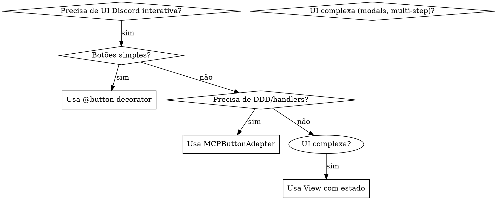

# Skill Discord Interactions

## Visão Geral

Interações Discord permitem UI orientada a eventos: botões, selects, modals que disparam callbacks. O decorator `@button` faz o roteamento automaticamente - sem necessidade de matching manual de `custom_id`.

**Padrão core:** `View` com decorators `@button` → `on_interaction` loga → decorator trata roteamento.

---

## Fluxo de Decisão Rápida



---

## Nomes de Event Handlers (Crítico)

| Tipo de Bot | Nome do Handler | Nota |
|-------------|-----------------|------|
| `Client` | `on_interaction` | **NÃO** é `on_interaction_create` |
| `commands.Bot` | `on_interaction_create` | Subclasse Bot |

**⚠️ Erro comum:** Usar `on_interaction_create` com `Client` = handler nunca dispara.

---

## Caso 1: Hello World (Botões Simples)

**Quando:** Protótipos rápidos, ações simples, bots de arquivo único.

```python
import asyncio
from discord import Client, Intents, InteractionType
from discord.ui import View, button, Button
from discord import ButtonStyle
from pathlib import Path
from dotenv import dotenv_values

class DebugView(View):
    """View com handler auto-roteado."""

    @button(label="Debug", style=ButtonStyle.primary, custom_id="debug_btn")
    async def debug_button(self, interaction, button):
        # Decorator roteia automaticamente - sem matching manual de custom_id
        await interaction.response.send_message("✅ Debug!", ephemeral=True)


class MiniBot(Client):
    def __init__(self):
        super().__init__(intents=Intents.default())

    async def on_ready(self):
        channel = self.get_channel(1487929503073173727)
        await channel.send("Debug Bot", view=DebugView())

    async def on_interaction(self, interaction):
        # Opcional: loga todas as interações
        if interaction.type == InteractionType.component:
            print(f"Interaction: {interaction.data.get('custom_id')}")


async def main():
    config = dotenv_values(Path.home() / ".claude/channels/discord" / ".env")
    token = config["DISCORD_BOT_TOKEN"]
    await MiniBot().start(token)


if __name__ == "__main__":
    asyncio.run(main())
```

**Pontos chave:**
- Decorator `@button` = roteamento automático por `custom_id`
- `on_interaction` (NÃO `on_interaction_create`) para `Client`
- `ephemeral=True` = só usuário vê resposta

---

## Caso 2: Domain-Driven Design (Paper Trading)

**Quando:** Lógica de negócio, arquitetura orientada a eventos, múltiplos handlers, camadas DDD.

```python
# Camada Infrastructure - Adapter
class MCPButtonAdapter:
    """Converte interações Discord em Commands DDD."""

    def __init__(self, event_publisher):
        self._event_publisher = event_publisher
        self._handler = ButtonClickHandler(event_publisher)

    async def handle_interaction(self, interaction) -> dict:
        # 1. Converte para Command
        command = HandleButtonClickCommand.from_discord_interaction(interaction)

        # 2. Processa via Handler
        result = await self._handler.handle(command)

        # 3. Publica Domain Event
        await self._event_publisher.publish(command.to_event())

        return {"status": "success" if result.is_success else "error"}


# Camada Application - Handler
class ButtonClickHandler(BaseHandler):
    async def handle(self, command: HandleButtonClickCommand) -> HandlerResult:
        if not command.button_custom_id:
            return HandlerResult.error("button_custom_id obrigatório")

        # Lógica de negócio aqui
        event = command.to_event()
        await self._event_publisher.publish(event)

        return HandlerResult.success(data={"button_id": command.button_custom_id})


# Camada Presentation - Bot
class PaperTradingBot(Client):
    def __init__(self, event_publisher):
        super().__init__(intents=Intents.default())
        self.button_adapter = MCPButtonAdapter(event_publisher)

    async def on_interaction(self, interaction):
        if interaction.type != InteractionType.component:
            return

        result = await self.button_adapter.handle_interaction(interaction)

        if result["status"] == "success":
            await interaction.response.send_message("✅ Ordem processada", ephemeral=True)
        else:
            await interaction.response.send_message(f"❌ {result['message']}", ephemeral=True)
```

**Fluxo:** `Interaction` → `Command` → `Handler` → `Domain Event` → `Response`

---

## Caso 3: UI Complexa (Select Menus + Estado)

**Quando:** Fluxos multi-step, opções dinâmicas, interações com estado.

```python
import discord
from discord.ui import View, Select, Button, button

class TradingView(View):
    """UI de trading multi-step com estado."""

    def __init__(self, bot):
        super().__init__(timeout=None)
        self.bot = bot
        self.selected_asset = None

    @discord.ui.select(
        placeholder="Escolha o ativo...",
        options=[
            discord.SelectOption(label="BTC", value="btc"),
            discord.SelectOption(label="ETH", value="eth"),
        ]
    )
    async def asset_select(self, interaction, select):
        self.selected_asset = select.values[0]
        await interaction.response.send_message(f"Selecionado: {self.selected_asset}", ephemeral=True)

    @button(label="Comprar", style=ButtonStyle.success, row=1)
    async def buy_button(self, interaction, button):
        if not self.selected_asset:
            await interaction.response.send_message("❌ Selecione um ativo primeiro", ephemeral=True)
            return

        # Executa ordem de compra
        await self.bot.execute_order("BUY", self.selected_asset)
        await interaction.response.send_message(f"✅ Comprou {self.selected_asset}", ephemeral=True)

    @button(label="Vender", style=ButtonStyle.danger, row=1)
    async def sell_button(self, interaction, button):
        if not self.selected_asset:
            await interaction.response.send_message("❌ Selecione um ativo primeiro", ephemeral=True)
            return

        await self.bot.execute_order("SELL", self.selected_asset)
        await interaction.response.send_message(f"✅ Vendeu {self.selected_asset}", ephemeral=True)


class TradingBot(discord.Client):
    async def execute_order(self, side, asset):
        # Lógica de negócio para execução de ordem
        print(f"Executando {side} {asset}")

    async def on_ready(self):
        channel = self.get_channel(CHANNEL_ID)
        await channel.send("📊 Painel de Trading", view=TradingView(self))
```

**Padrões chave:**
- View mantém estado (`self.selected_asset`)
- Múltiplos componentes compartilham estado
- Validação antes da ação
- Parâmetro `row` para layout

---

## Padrões de Resposta

| Padrão | Código | Quando |
|---------|--------|--------|
| **Imediata** | `interaction.response.send_message()` | Operação rápida (<2s) |
| **Defer + Edit** | `defer() → edit_original_message()` | Operação lenta (>2s) |
| **Modal** | `interaction.response.send_modal()` | Input de formulário |
| **Efêmera** | `ephemeral=True` | Resposta privada |

### Padrão Defer (Operações Lentas)

```python
async def slow_button(self, interaction, button):
    # Confirma imediatamente
    await interaction.response.defer()

    # Faz trabalho lento
    resultado = await consulta_lenta_bd()

    # Edita a mensagem "pensando..."
    await interaction.followup.send(f"Resultado: {resultado}")
```

---

## Modals (Formulários)

```python
from discord.ui import Modal, TextInput

class OrderModal(Modal, title='Nova Ordem'):
    asset = TextInput(label='Ativo (BTC/ETH)', placeholder='BTC')
    quantidade = TextInput(label='Quantidade', placeholder='0.001')

    async def on_submit(self, interaction):
        await interaction.response.send_message(
            f"Ordem: {self.quantidade.value} {self.asset.value}",
            ephemeral=True
        )

class TradingView(View):
    @button(label="Nova Ordem")
    async def new_order(self, interaction, button):
        await interaction.response.send_modal(OrderModal())
```

---

## Erros Comuns

| Erro | Sintoma | Correção |
|------|---------|----------|
| `on_interaction_create` com `Client` | Handler nunca dispara | Use `on_interaction` |
| Esquecer `await` antes da response | "Esta interação falhou" | Sempre `await interaction.response...` |
| Sem resposta enviada | "Esta interação falhou" | Sempre chame `response.send_message()` ou `defer()` |
| Usar strings `custom_id` manualmente | Frágil, propenso a erros | Use decorator `@button` |
| Misturar efêmero/público | UX confusa | Seja consistente, documente comportamento |

---

## Tipos de Componentes

| Tipo | Usar Quando | Import |
|------|-------------|--------|
| `Button` | Ações simples | `from discord.ui import button, Button` |
| `Select` | Escolha única/múltipla | `from discord.ui import Select` |
| `Modal` | Input de formulário | `from discord.ui import Modal, TextInput` |
| `View` | Container para componentes | `from discord.ui import View` |

---

## Referência: Eventos discord.py

| Handler | Dispara Quando |
|---------|----------------|
| `on_ready()` | Bot conectado |
| `on_interaction()` | Qualquer interação (Client) |
| `on_interaction_create()` | Qualquer interação (Bot) |
| `on_raw_interaction_delete()` | Mensagem com componentes deletada |

---

## Testando Interações

```python
# Teste manual - envia botão e clica
await channel.send("Teste", view=DebugView())
# Clica no botão no cliente Discord
# Verifica logs no console
```

---

> "Boa UI é invisível - interações simplesmente funcionam" – made by Sky 🎮
