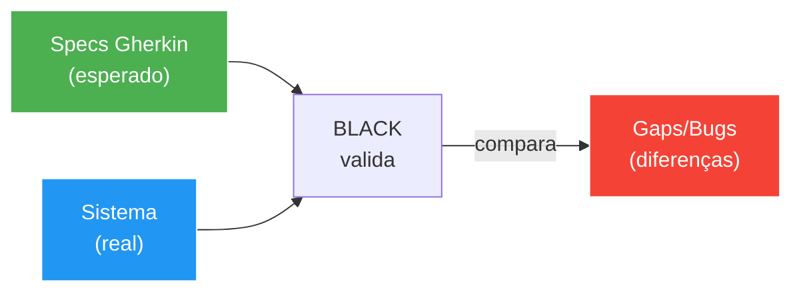
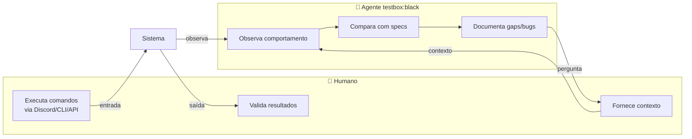
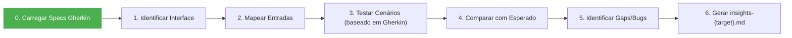
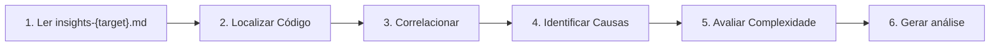
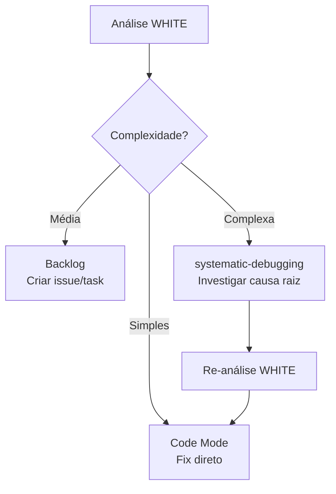
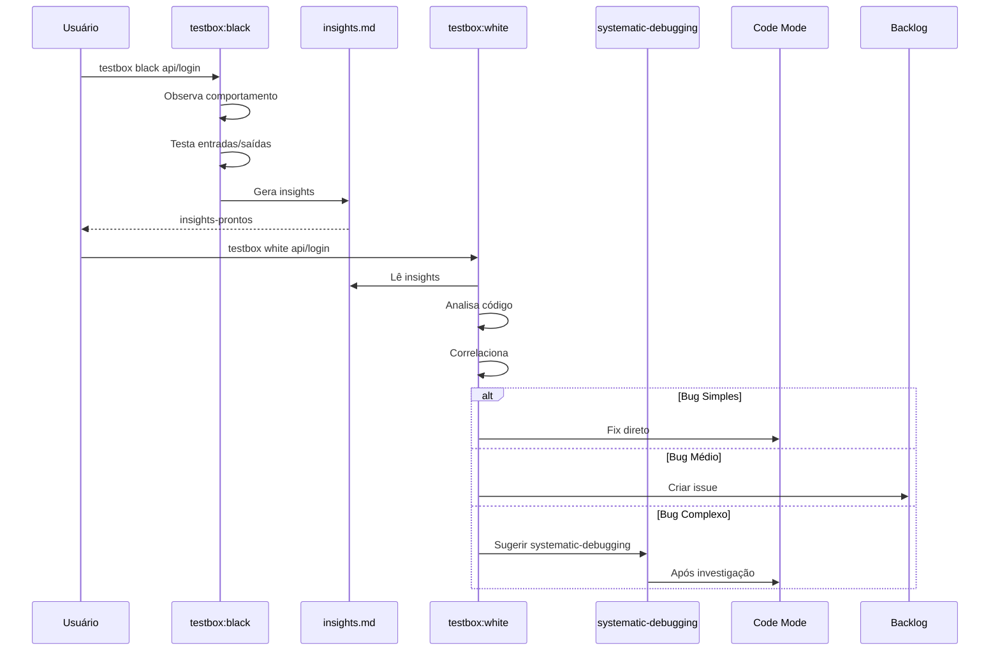

# Testbox - Análise Caixa Preta/Caixa Branca

Skill baseada no princípio de testes de software: primeiro observar o comportamento externo (caixa preta), depois analisar a estrutura interna (caixa branca).

## Filosofia

```
"Primeiro entenda o que o sistema FAZ (contra as specs), depois entenda COMO ele faz."
```

## Fonte de Verdade: Specs Gherkin

O modo BLACK usa **specs Gherkin** como guia do comportamento esperado:



### Onde encontrar as Specs

As specs Gherkin estão em `openspec/specs/` e `openspec/changes/`:

```
openspec/
├── specs/
│   └── *.feature        # Specs de contratos gerais
└── changes/
    └── {change-id}/
        ├── {change-id}.feature    # Spec principal da change
        └── scenarios/
            └── *.feature          # Cenários específicos
```

## Os Dois Modos

| Modo | Foco | Analogia | Saída |
|------|------|----------|-------|
| **BLACK** | Comportamento externo | Usuário do sistema | `insights-{target}.md` |
| **WHITE** | Estrutura interna | Desenvolvedor do sistema | `analysis-{target}.md` |

---

## Modo BLACK (Caixa Preta)

### TRIGGERS

- "testbox black {sistema}"
- "testbox black {sistema} --change {change-id}"
- "analisar comportamento de {sistema}"
- "observar funcionamento de {sistema}"
- "testar {sistema} como caixa preta"

### PRINCÍPIOS

1. **USE specs Gherkin como guia** - Elas definem o esperado
2. **HUMANO NO LOOP** - O humano executa comandos, o agente documenta
3. **NÃO leia o código-fonte** - Apenas interfaces públicas
4. **NÃO acesse arquivos internos** - Apenas endpoints/APIs
5. **NÃO assuma implementação** - Apenas observe comportamento
6. **DOCUMENTE tudo** - Entradas, saídas, gaps vs specs

### HUMANO NO LOOP

O modo BLACK é **colaborativo**: o humano interage com o sistema enquanto o agente observa e documenta.



#### Exemplo de Interação

```
👤 Humano (no Discord): "deposita 1000 USD"
🤖 Agente: [observa] Comando executado, saldo atualizado
👤 Humano: "compra 0.5 BTC-USD"
🤖 Agente: [observa] Ordem executada a mercado @ $67,000
👤 Humano: "qual meu saldo?"
🤖 Agente: [observa] Retorna $66500 USD + 0.5 BTC-USD
🤖 Agente: [documenta] GAP: não há comando "saldo" direto, precisa calcular
```

#### Responsabilidades

| Quem | Responsabilidade |
|------|------------------|
| **Humano** | Executar comandos, validar resultados, explicar contexto |
| **Agente** | Observar, comparar com specs, documentar, fazer perguntas |

### PROCESSO



### PASSOS DETALHADOS

#### 0. Carregar Specs Gherkin (Obrigatório)

**Antes de qualquer teste**, localize e leia as specs Gherkin:

```bash
# Estrutura em openspec/
openspec/
├── specs/
│   └── *.feature              # Specs de contratos gerais
└── changes/
    └── {change-id}/
        ├── {change-id}.feature    # Spec principal da change
        └── scenarios/
            └── *.feature          # Cenários específicos
```

**Parse dos cenários Gherkin:**

```gherkin
Feature: Paper Trading M0
  Como trader
  Quero operar ativos via Discord
  Para testar estratégias sem risco real

  Scenario: Comprar ativo a mercado
    Given saldo disponível de $100000 USD
    When executo "buy BTC-USD 0.5"
    Then posição de 0.5 BTC-USD deve ser aberta
    And saldo deve ser debitado
```

**Extraia para cada cenário:**

| Campo | Valor do Gherkin |
|-------|------------------|
| **Dado (Given)** | Pré-condições |
| **Quando (When)** | Ação a executar |
| **Então (Then)** | Resultado esperado |
| **E (And)** | Condições adicionais |

#### 1. Identificar Interface

- Qual é a API pública?
- Quais são os endpoints/comandos disponíveis?
- Qual é a documentação existente?
- **Mapear para os cenários Gherkin**

#### 2. Mapear Entradas

Liste todas as entradas baseado nos cenários Gherkin:

```markdown
## Entradas Identificadas (dos cenários Gherkin)

| Cenário | Entrada | Tipo | Esperado |
|---------|---------|------|----------|
| Comprar a mercado | buy {ativo} {qty} | comando | Posição aberta |
| Ordem limit | buy {ativo} {qty} at {price} | comando | Ordem pendente |
```

#### 3. Testar Cenários (baseado em Gherkin)

Execute cada cenário da spec Gherkin:

```markdown
## Cenários Testados (conforme Gherkin)

### Cenário: Comprar ativo a mercado
**Source:** `openspec/changes/M0/scenarios/buy-market.feature`

| Gherkin | Observado | Status |
|---------|-----------|--------|
| Given: saldo $100k USD | Saldo: $213k USD | ✅ |
| When: buy BTC-USD 0.5 | Executado | ✅ |
| Then: posição 0.5 BTC-USD | Posição: 1 BTC-USD | ⚠️ Qty diferente |
| And: saldo debitado | Saldo: $146k USD | ✅ |
```

#### 4. Registrar Saídas

Documente todas as saídas observadas:

```markdown
## Saídas Observadas

| Cenário | Saída Esperada | Saída Real | Match? |
|---------|----------------|------------|--------|
| ...     | ...            | ...        | ...    |
```

#### 5. Identificar Padrões

- Quais comportamentos são consistentes?
- Quais são imprevisíveis?
- Há diferenças entre ambientes?

#### 6. Documentar Gaps/Bugs

```markdown
## Gaps Identificados

| ID | Descrição | Impacto | Prioridade |
|----|-----------|---------|------------|
| GAP-1 | ... | ... | Alta/Média/Baixa |

## Bugs Encontrados

| ID | Descrição | Reproduzível | Workaround |
|----|-----------|--------------|------------|
| BUG-1 | ... | Sim/Não | ... |
```

#### 7. Gerar insights-{target}.md

Use o template em `templates/insights.md`.

### HANDOFF PARA WHITE

Ao final do modo BLACK, gere:

```markdown
---
target: {sistema}
mode: black
generated_at: {timestamp}
ready_for_white: true
---

# Insights [BLACK] - {sistema}

## Resumo Executivo
{resumo em 2-3 frases}

## Entradas Testadas
{tabela}

## Saídas Observadas
{tabela}

## Gaps Identificados
{lista}

## Bugs Encontrados
{lista}

## Hipóteses para WHITE
- [ ] Verificar se X é implementado como Y
- [ ] Investigar por que Z acontece
- [ ] Confirmar estrutura de W

## Próximos Passos
1. Rodar `testbox white {sistema}` para análise estrutural
```

---

## Modo WHITE (Caixa Branca)

### TRIGGERS

- "testbox white {sistema}"
- "analisar código de {sistema}"
- "investigar estrutura de {sistema}"
- "testbox white" (quando insights-{target}.md existe)

### PRÉ-REQUISITOS

- Arquivo `insights-{target}.md` deve existir (criado pelo modo BLACK)
- Se não existir, perguntar se quer criar primeiro

### PRINCÍPIOS

1. **USE os insights do BLACK** - Não comece do zero
2. **Analise o código-fonte** - Entenda a implementação
3. **Correlacione** - Conecte comportamento com código
4. **Identifique causa raiz** - Não apenas sintomas

### PROCESSO



### PASSOS DETALHADOS

#### 1. Ler insights-{target}.md

Extraia:
- Gaps identificados
- Bugs encontrados
- Hipóteses para investigar

#### 2. Localizar Código

Encontre os arquivos relevantes:

```markdown
## Arquivos Analisados

| Arquivo | Relevância | Gap/Bug Relacionado |
|---------|------------|---------------------|
| ...     | ...        | ...                 |
```

#### 3. Correlacionar

Conecte comportamento com implementação:

```markdown
## Correlações

| Comportamento (BLACK) | Implementação (WHITE) | Linha | Status |
|-----------------------|----------------------|-------|--------|
| ...                   | ...                  | ...   | ✅/⚠️/❌ |
```

Status:
- ✅ = Comportamento corresponde à implementação
- ⚠️ = Comportamento parcialmente explicado
- ❌ = Comportamento não corresponde (possível bug)

#### 4. Identificar Causas

Para cada gap/bug:

```markdown
## Análise de Causa

### GAP-X: {título}
- **Arquivo:** {caminho}:{linha}
- **Causa:** {explicação técnica}
- **Solução Proposta:** {como resolver}
```

#### 5. Avaliar Complexidade

Classifique cada item:

| Complexidade | Ação |
|--------------|------|
| **Simples** | Fix direto, passar para Code Mode |
| **Média** | Criar tarefa no backlog |
| **Complexa** | Sugerir `systematic-debugging` |

#### 6. Gerar análise

Use o template em `templates/analysis.md`.

### INTEGRAÇÃO COM SYSTEMATIC-DEBUGGING

#### Quando Sugerir

Se durante a análise WHITE você encontrar:

1. **Bug complexo** - Não óbvio à primeira leitura
2. **Multi-componente** - Envolve mais de uma camada
3. **Comportamento inesperado** - Código parece correto mas falha
4. **Race condition** - Problemas de concorrência
5. **3+ tentativas de fix falharam** - Hora de repensar

#### Como Sugerir

```markdown
🔍 **Bug complexo detectado.**

O bug {ID} requer investigação profunda de causa raiz.

**Sugestão:** Use a skill `systematic-debugging` antes de propor fixes.

```
Use: systematic-debugging skill
Contexto: {descrição do bug}
Arquivos suspeitos: {lista}
```

Isso garantirá que encontramos a causa raiz, não apenas o sintoma.
```

### HANDOFF PARA BACKLOG/DEBUG

Ao final do modo WHITE:



---

## Fluxo Completo



---

## Templates

### insights.md (modo BLACK)

Ver arquivo: `templates/insights.md`

### analysis.md (modo WHITE)

Ver arquivo: `templates/analysis.md`

---

## Exemplos de Uso

### Exemplo 1: Paper Trading M0

```bash
# Passo 1: Observar comportamento
> testbox black paper-trading

# Agente testa via Discord MCP:
# - Comprar/vender ativos
# - Verificar posições
# - Consultar saldo
# - Verificar PnL

# Gera: insights-paper-trading.md
# Com: GAP-1 a GAP-4, BUG-1 e BUG-2

# Passo 2: Analisar estrutura
> testbox white paper-trading

# Agente lê insights e analisa:
# - src/core/paper/facade/api.app
# - src/core/paper/engine.py
# - src/core/paper/portfolio.py

# Gera: analysis-paper-trading.md
# Com: Correlações, causas, sugestões
```

### Exemplo 2: API de Login

```bash
# Passo 1: BLACK
> testbox black api/auth

# Testa:
# - Login válido
# - Login inválido
# - Token expirado
# - Rate limiting

# Passo 2: WHITE
> testbox white api/auth

# Analisa:
# - auth/service.py
# - auth/middleware.py
# - token/validator.py
```

---

## Regras de Ouro

1. **BLACK primeiro, sempre** - Não pule para WHITE sem observar
2. **Documente tudo** - Insights são valiosos para regressão
3. **Handoff explícito** - Deixe claro o próximo passo
4. **Delegue quando necessário** - Bug complexo → systematic-debugging
5. **Rastreabilidade** - Cada gap/bug deve ter ID único

---

## Integrações

| Skill | Quando Usar |
|-------|-------------|
| `systematic-debugging` | Bug complexo, multi-componente |
| `test-driven-development` | Antes de implementar fix |
| `linear-sync` | Criar issues no backlog |
| `task-helper` | Criar tarefas Hadsteca |

---

> "Clareza primeiro, execução depois." – made by Sky ✨
