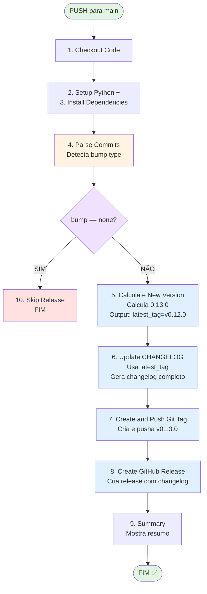

# Guia de Release - Passo a Passo

**Workflow:** `.github/workflows/release.yml`
**Objetivo:** Criar releases automáticas com changelog gerado

---

## Índice dos Steps

1. [Checkout code](#1-checkout-code)
2. [Setup Python](#2-setup-python)
3. [Install Python dependencies](#3-install-python-dependencies)
4. [Parse commits and determine version bump](#4-parse-commits-and-determine-version-bump)
5. [Calculate new version](#5-calculate-new-version)
6. [Update CHANGELOG](#6-update-changelog)
7. [Create and push git tag](#7-create-and-push-git-tag)
8. [Create GitHub Release](#8-create-github-release)
9. [Summary](#9-summary)
10. [Skip release](#10-skip-release)

---

## 1. Checkout code

**Step name:** `Checkout code`

**O que faz:**
- Clona o repositório do GitHub para o runner (máquina virtual onde o workflow roda)

**Para que serve:**
- Sem isso, o workflow não tem acesso ao código
- Precisa do código para: analisar commits, executar scripts, criar tags, etc.

**Detalhes importantes:**
- Usa a action oficial `actions/checkout@v4`
- `fetch-depth: 0` → Baixa TODO o histórico (não só o último commit)
  - Necessário para analisar commits desde a última tag
- `token: ${{ secrets.GITHUB_TOKEN }}` → Permite fazer push de mudanças (commit do changelog, nova tag)

**Próximo:** → [Setup Python](#2-setup-python)

---

## 2. Setup Python

**Step name:** `Setup Python`

**O que faz:**
- Instala Python 3.11 no runner

**Para que serve:**
- O runner vem com Ubuntu, mas precisa do Python específico
- O script `changelog.py` é escrito em Python

**Detalhes importantes:**
- Usa a action oficial `actions/setup-python@v5`
- `cache: 'pip'` → Faz cache das dependências (acelera próximas runs)

**Próximo:** → [Install Python dependencies](#3-install-python-dependencies)

---

## 3. Install Python dependencies

**Step name:** `Install Python dependencies`

**O que faz:**
- Instala os pacotes Python necessários

**Para que serve:**
- O projeto Skybridge precisa estar instalado para o `changelog.py` funcionar
- O `changelog.py` usa a biblioteca `requests` para chamar a API do GitHub

**Comandos executados:**
```bash
pip install --upgrade pip           # Atualiza o pip
pip install -e .                    # Instala Skybridge em modo editable
pip install requests                # Instala requests para API do GitHub
```

**Próximo:** → [Parse commits and determine version bump](#4-parse-commits-and-determine-version-bump)

---

## 4. Parse commits and determine version bump

**Step name:** `Parse commits and determine version bump`

**ID do step:** `parse_commits`

**O que faz:**
- Analisa as mensagens de commit desde a última tag
- Determina o tipo de bump: MAJOR, MINOR, PATCH ou NONE

**Para que serve:**
- Segue o Semantic Versioning (SemVer)
- Usa Conventional Commits para decidir o tipo de versão

**Regras de detecção:**

| Padrão encontrado | Tipo de bump | Exemplo de versão |
|-------------------|--------------|-------------------|
| `BREAKING CHANGE` ou `feat!` ou `fix!` | **MAJOR** | 0.12.0 → **1.0.0** |
| `feat:` (qualquer lugar da mensagem) | **MINOR** | 0.12.0 → **0.13.0** |
| `fix:` (qualquer lugar da mensagem) | **PATCH** | 0.12.0 → **0.12.1** |
| Nenhum dos acima | **NONE** | Não cria release |

**Output do step:**
- `bump` → `major`, `minor`, `patch`, ou `none`

**Comandos executados:**
```bash
# Pega a última tag (ex: v0.12.0)
LATEST_TAG=$(git describe --tags --abbrev=0 2>/dev/null || echo "")

# Se não tem tag, usa todos os commits. Se tem, usa desde a tag.
git log ${LATEST_TAG}..HEAD --pretty=format:"%H %s"

# Analisa cada commit procurando por feat:, fix:, BREAKING CHANGE
```

**Exemplo prático:**
```
Commits desde v0.12.0:
feat(kanban): implementa visualização Kanban Fase 1
fix(api): corrige erro 422 em /webhooks/worktrees
docs: adiciona PL003

Resultado: MINOR bump (detectou "feat:")
```

**Próximo:** → [Calculate new version](#5-calculate-new-version) (se bump ≠ none)

---

## 5. Calculate new version

**Step name:** `Calculate new version`

**ID do step:** `bump_version`

**Condição:** Só roda se `steps.parse_commits.outputs.bump != 'none'`

**O que faz:**
- Lê a versão atual da última tag
- Aplica o bump (major/minor/patch)
- Calcula a nova versão

**Para que serve:**
- Define qual será a próxima versão do projeto
- Guarda a `latest_tag` para o step de changelog usar

**Lógica de cálculo:**

| Bump type | Regra | Exemplo |
|-----------|-------|---------|
| **MAJOR** | Major + 1, minor = 0, patch = 0 | 0.12.0 → **1.0.0** |
| **MINOR** | Minor + 1, patch = 0 | 0.12.0 → **0.13.0** |
| **PATCH** | Patch + 1 | 0.12.0 → **0.12.1** |

**Comandos executados:**
```bash
# Lê versão atual da tag (remove o "v")
CURRENT_VERSION=${LATEST_TAG#v}  # v0.12.0 → 0.12.0

# Separa em partes
IFS='.' read -ra PARTS <<< "$CURRENT_VERSION"
MAJOR=${PARTS[0]}  # 0
MINOR=${PARTS[1]}  # 12
PATCH=${PARTS[2]}  # 0

# Aplica bump
case $BUMP_TYPE in
  major) MAJOR=$((MAJOR + 1)); MINOR=0; PATCH=0 ;;
  minor) MINOR=$((MINOR + 1)); PATCH=0 ;;
  patch) PATCH=$((PATCH + 1)) ;;
esac

NEW_VERSION="${MAJOR}.${MINOR}.${PATCH}"  # 0.13.0
```

**Output do step:**
- `new_version` → Nova versão calculada (ex: `0.13.0`)
- `latest_tag` → Tag anterior (ex: `v0.12.0`) ⚠️ **CRÍTICO para o próximo step**

**Próximo:** → [Update CHANGELOG](#6-update-changelog)

---

## 6. Update CHANGELOG

**Step name:** `Update CHANGELOG`

**Condição:** Só roda se `steps.parse_commits.outputs.bump != 'none'`

**O que faz:**
- Executa o script `runtime/changelog.py`
- Gera o changelog da nova versão
- Commita o CHANGELOG.md
- Extrai as notas da release para um arquivo temporário

**Para que serve:**
- Cria o histórico de mudanças de forma automatizada
- Alimenta o conteúdo da Release no GitHub

**⚠️ ORDEM CRÍTICA:**
Este step DEVE vir ANTES de "Create and push git tag"!

**Por que?**
- Se criarmos a tag antes, o `git describe` vai retornar a NOVA tag
- O changelog tentaria pegar commits entre v0.13.0 e v0.13.0 = VAZIO
- Usamos o `latest_tag` do step anterior (que ainda é a versão anterior)

**Comandos executados:**
```bash
# Recebe variáveis do step anterior
NEW_VERSION=${{ steps.bump_version.outputs.new_version }}    # 0.13.0
LATEST_TAG=${{ steps.bump_version.outputs.latest_tag }}      # v0.12.0

# Executa script de changelog
python runtime/changelog.py "0.13.0" "v0.12.0" --from-gh --detailed --apply
# --from-gh: Usa API do GitHub para informações dos commits
# --detailed: Gera changelog completo com categorias
# --apply: Aplica mudanças no CHANGELOG.md

# Configura git para commit
git config user.name "github-actions[bot]"
git config user.email "github-actions[bot]@users.noreply.github.com"

# Commita o CHANGELOG se mudou
git add CHANGELOG.md
if ! git diff --cached --quiet; then
  git commit -m "docs(release): update changelog for 0.13.0"
  git push
fi

# Extrai a seção da nova versão para arquivo temporário
# Isso alimenta o body da Release no próximo step
sed -n "/## \[0.13.0\]/,/## \[/p" CHANGELOG.md | head -n -1 > release_notes.md
```

**O que o changelog.py gera:**

```markdown
## [0.13.0] - 2026-02-01

### ✨ Novidades
* feat(kanban): implementa visualização Kanban Fase 1
* feat(workspaces): implementa PL003

### 🐛 Correções
* fix(api): corrige erro 422 em /webhooks/worktrees

### 📚 Documentação
* docs: adiciona PL003
```

**Arquivo gerado:** `release_notes.md` (temporário, usado apenas para criar a Release)

**Próximo:** → [Create and push git tag](#7-create-and-push-git-tag)

---

## 7. Create and push git tag

**Step name:** `Create and push git tag`

**Condição:** Só roda se `steps.parse_commits.outputs.bump != 'none'`

**O que faz:**
- Cria uma tag git anotada com a nova versão
- Pusha a tag para o repositório remoto

**Para que serve:**
- Tags git são a **fonte única da verdade** para versões (PL001)
- A Release no GitHub references a tag
- Permite versionar o código de forma semântica

**⚠️ ORDEM CRÍTICA:**
Este step DEPOIS virar DEPOIS de "Update CHANGELOG"!

**Comandos executados:**
```bash
NEW_VERSION=${{ steps.bump_version.outputs.new_version }}  # 0.13.0

# Configura git
git config user.name "github-actions[bot]"
git config user.email "github-actions[bot]@users.noreply.github.com"

# Cria tag anotada
git tag -a "v0.13.0" -m "Release v0.13.0"
# -a: annotated (tem mensagem, data, autor)
# Anotada é melhor que lightweight tag para releases

# Pusha a tag
git push origin "v0.13.0"
```

**Resultado:**
- Tag `v0.13.0` criada localmente
- Tag pushada para o GitHub
- Pronta para ser usada pela Release

**Próximo:** → [Create GitHub Release](#8-create-github-release)

---

## 8. Create GitHub Release

**Step name:** `Create GitHub Release`

**Condição:** Só roda se `steps.parse_commits.outputs.bump != 'none'`

**O que faz:**
- Cria uma Release no GitHub usando a tag criada
- Popula a Release com o changelog gerado

**Para que serve:**
- Release é o que os usuários veem no GitHub
- Contém notas oficiais da versão
- Permite download de assets (futuramente)

**Detalhes:**
- Usa a action `softprops/action-gh-release@v1`
- `tag_name`: Nome da tag (ex: `v0.13.0`)
- `name`: Nome da Release (ex: `Release v0.13.0`)
- `body_path`: Arquivo com o conteúdo (release_notes.md gerado anteriormente)
- `draft`: `false` → Release pública, não rascunho
- `prerelease`: `false` → Release estável, não pré-release

**Token usado:**
- `GITHUB_TOKEN` → Token automático do GitHub Actions
- Tem permissão `contents: write` (definida no workflow)

**Resultado:**
```
GitHub → Repositório → Releases → v0.13.0

Título: Release v0.13.0
Conteúdo: (changelog completo do release_notes.md)
```

**Próximo:** → [Summary](#9-summary)

---

## 9. Summary

**Step name:** `Summary`

**Condição:** Só roda se `steps.parse_commits.outputs.bump != 'none'`

**O que faz:**
- Cria um resumo da release no GitHub Actions
- Aparece na página da workflow run

**Para que serve:**
- Documentação visual do que aconteceu
- Fácil de verificar se a release foi bem-sucedida

**Conteúdo do resumo:**
```markdown
## Release created! :rocket:

- **Version:** v0.13.0
- **Bump type:** minor
- **Tag:** v0.13.0
- **Source of truth:** Git tags (PL001)
```

**Próximo:** → Fim

---

## 10. Skip release

**Step name:** `Skip release`

**Condição:** Só roda se `steps.parse_commits.outputs.bump == 'none'`

**O que faz:**
- Informa que não houve release necessária

**Para que serve:**
- Feedback claro de que o workflow rodou mas não criou release
- Acontece quando não há commits `feat:`, `fix:` ou `BREAKING`

**Conteúdo do resumo:**
```markdown
## No release needed

No feat/fix/BREAKING commits found since last release.
```

**Próximo:** → Fim

---

## Fluxo Completo Visual

### Diagrama Mermaid



### ASCII Art

```
┌─────────────────────────────────────────────────────────────────┐
│                    PUSH PARA MAIN                               │
└─────────────────────────────────────────────────────────────────┘
                            ↓
┌─────────────────────────────────────────────────────────────────┐
│  1. Checkout code                                               │
│     Clona repositório com histórico completo                    │
└─────────────────────────────────────────────────────────────────┘
                            ↓
┌─────────────────────────────────────────────────────────────────┐
│  2. Setup Python + 3. Install dependencies                      │
│     Prepara ambiente para executar changelog.py                 │
└─────────────────────────────────────────────────────────────────┘
                            ↓
┌─────────────────────────────────────────────────────────────────┐
│  4. Parse commits → Detecta bump type                           │
│     Analisa commits desde última tag                            │
│     Output: bump=minor (exemplo)                                │
└─────────────────────────────────────────────────────────────────┘
                            ↓
        ┌───────────────────┴───────────────────┐
        │ bump == none?                         │
        └───────────────────┬───────────────────┘
                            ↓
                    ┌───────┴────────┐
                    │ NÃO            │ SIM
                    ↓                ↓
┌─────────────────────────────────┐   ┌───────────────────┐
│  5. Calculate new version       │   │ 10. Skip release  │
│     Calcula 0.13.0              │   │     (FIM)         │
│     Output: latest_tag=v0.12.0  │   └───────────────────┘
└─────────────────────────────────┘
            ↓
┌─────────────────────────────────┐
│  6. Update CHANGELOG ← USA      │
│     latest_tag (0.12.0)         │
│     Gera changelog completo     │
└─────────────────────────────────┘
            ↓
┌─────────────────────────────────┐
│  7. Create and push git tag     │
│     Cria e pusha v0.13.0        │
└─────────────────────────────────┘
            ↓
┌─────────────────────────────────┐
│  8. Create GitHub Release       │
│     Cria release com changelog  │
└─────────────────────────────────┘
            ↓
┌─────────────────────────────────┐
│  9. Summary                     │
│     Mostra resumo da release    │
└─────────────────────────────────┘
            ↓
          ✅ FIM
```

---

## Conventional Commits

Para que o release funcione corretamente, use este padrão nos commits:

```
<tipo>(<escopo>): <descrição>

[opcional: corpo]

[opcional: footer]
```

**Tipos suportados:**

| Tipo | Bump | Exemplo |
|------|------|---------|
| `feat` | MINOR | `feat(auth): adiciona login OAuth` |
| `fix` | PATCH | `fix(api): corrige erro 500 ao criar usuário` |
| `refactor` | none | `refactor(user): extrai validação para função separada` |
| `docs` | none | `docs(readme): atualiza instruções de instalação` |
| `test` | none | `test(auth): adiciona teste para login falhando` |
| `chore` | none | `chore: atualiza dependências` |

**Breaking Changes:**

```
feat!: remove API de usuários

ou

feat(api): adiciona novo endpoint

BREAKING CHANGE: o formato de resposta mudou
```

---

> "Documentação é amor que dura para sempre" – made by Sky 📚
