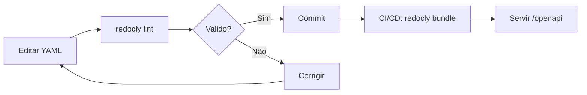

# PB010 — Redocly CLI para Validação e Bundle de OpenAPI

## 0) Propósito

Guia prático para instalação, configuração e uso do **Redocly CLI** no projeto Skybridge, substituindo o `openapi-spec-validator` conforme ADR016.

---

## 1) Visão Geral

### 1.1 O que é Redocly CLI?

Ferramenta de linha de comando para:
- ✅ Validar specs OpenAPI 3.0/3.1
- ✅ Resolver `$ref` externos (bundle)
- ✅ Servir documentação local (preview)
- ✅ Gerar HTML estático
- ✅ Dividir specs em múltiplos arquivos

### 1.2 Por que Redocly?

| Critério | Redocly CLI | openapi-spec-validator |
|----------|-------------|------------------------|
| Suporte a `$ref` externos | ✅ Excelente | ❌ Limitado |
| Performance | ✅ Rápido | ⚠️ Lento |
| Ativo/mantido | ✅ Sim | ⚠️ Pouco |
| Comunidade | ✅ Grande | ⚠️ Pequena |
| CLI completa | ✅ Sim | ❌ Apenas validação |

---

## 2) Instalação

### 2.1 Pré-requisitos

```bash
# Verificar Node.js
node --version  # v18+ recomendado

# Verificar npm
npm --version
```

### 2.2 Instalação Global

```bash
npm install -g @redocly/cli

# Verificar instalação
redocly --version
```

### 2.3 Instalação Local (opcional)

```bash
# No projeto
npm install --save-dev @redocly/cli

# Usar via npx
npx @redocly/cli lint docs/spec/openapi/openapi.yaml
```

---

## 3) Configuração

### 3.1 Arquivo `redocly.yaml`

Criar arquivo na raiz do projeto:

```yaml
extends:
  - recommended

apiTests:
  assertOperationIdFollowingNaming: warn
  assertNoOperationId: error
  assertTagsAlphabetical: off

rules:
  no-unused-components: warning
  tag-description: off
  operation-2xx-response: error
  operation-description: error
  spec: error
```

### 3.2 Configuração Mínima

```yaml
extends:
  - recommended
rules:
  no-unused-components: warning
```

---

## 4) Comandos Essenciais

### 4.1 Lint (Validação)

```bash
# Validar arquivo específico
redocly lint docs/spec/openapi/openapi.yaml

# Com formatação stylish
redocly lint docs/spec/openapi/openapi.yaml --format stylish

# Saída JSON (para CI/CD)
redocly lint docs/spec/openapi/openapi.yaml --format json

# Validar múltiplos arquivos
redocly lint docs/spec/**/*.yaml
```

**Saída esperada (sucesso):**
```
✓ docs/spec/openapi/openapi.yaml is valid
```

### 4.2 Bundle (Resolver $refs)

```bash
# Bundle com resolução de refs
redocly bundle docs/spec/openapi/openapi.yaml -o dist/openapi-bundled.yaml

# Bundle sem remover unused
redocly bundle docs/spec/openapi/openapi.yaml -o dist/openapi-bundled.yaml --keep-unused-components

# Bundle em JSON
redocly bundle docs/spec/openapi/openapi.yaml -o dist/openapi-bundled.yaml --type json

# Bundle com dereferencing
redocly bundle docs/spec/openapi/openapi.yaml -o dist/openapi-deref.yaml --dereferenced
```

### 4.3 Preview (Documentação Local)

```bash
# Servir em localhost:8080
redocly preview-docs docs/spec/openapi/openapi.yaml

# Porta customizada
redocly preview-docs docs/spec/openapi/openapi.yaml --port 9000

# Com watch (auto-reload)
redocly preview-docs docs/spec/openapi/openapi.yaml --watch
```

**Acesse:** `http://localhost:8080`

### 4.4 Build Docs

```bash
# Gerar HTML estático
redocly build-docs docs/spec/openapi/openapi.yaml -o dist/index.html
```

---

## 5) Integração com CI/CD

### 5.1 GitHub Actions

```yaml
# .github/workflows/openapi-lint.yml
name: OpenAPI Lint

on:
  push:
    paths:
      - 'docs/spec/**/*.yaml'
  pull_request:
    paths:
      - 'docs/spec/**/*.yaml'

jobs:
  lint:
    runs-on: ubuntu-latest
    steps:
      - uses: actions/checkout@v3

      - uses: actions/setup-node@v3
        with:
          node-version: '20'

      - name: Install Redocly CLI
        run: npm install -g @redocly/cli

      - name: Lint OpenAPI
        run: redocly lint docs/spec/openapi/openapi.yaml

      - name: Bundle OpenAPI
        run: redocly bundle docs/spec/openapi/openapi.yaml -o dist/openapi-bundled.yaml
```

### 5.2 Pre-commit Hook

```bash
# .git/hooks/pre-commit
#!/bin/bash
redocly lint docs/spec/openapi/openapi.yaml
if [ $? -ne 0 ]; then
  echo "❌ OpenAPI lint falhou"
  exit 1
fi
```

### 5.3 npm Scripts

```json
{
  "scripts": {
    "openapi:lint": "redocly lint docs/spec/openapi/openapi.yaml",
    "openapi:bundle": "redocly bundle docs/spec/openapi/openapi.yaml -o dist/openapi-bundled.yaml",
    "openapi:preview": "redocly preview-docs docs/spec/openapi/openapi.yaml"
  }
}
```

---

## 6) Troubleshooting

### 6.1 "Command not found"

```bash
# Verificar instalação
which redocly

# Usar npx
npx @redocly/cli lint docs/spec/openapi/openapi.yaml
```

### 6.2 "Schema references are not supported"

**Problema:** `$ref` externos

**Solução:**
```bash
# Use bundle para resolver refs
redocly bundle docs/spec/openapi/openapi.yaml -o openapi-resolved.yaml
```

### 6.3 Lint muito lento

**Solução:** Desabilitar regras pesadas
```yaml
rules:
  no-unused-components: off
```

---

## 7) Cheat Sheet

```bash
# === VALIDAR ===
redocly lint docs/spec/openapi/openapi.yaml
redocly lint docs/spec/openapi/openapi.yaml --format json

# === BUNDLE ===
redocly bundle docs/spec/openapi/openapi.yaml -o dist/openapi.yaml
redocly bundle docs/spec/openapi/openapi.yaml -o dist/openapi.yaml --dereferenced

# === PREVIEW ===
redocly preview-docs docs/spec/openapi/openapi.yaml
redocly preview-docs docs/spec/openapi/openapi.yaml --port 9000

# === BUILD ===
redocly build-docs docs/spec/openapi/openapi.yaml -o dist/index.html
```

---

## 8) Fluxo de Trabalho Skybridge



---

## 9) Integração com OpenAPI Híbrido (ADR016)

### 9.1 Validação Estática

```bash
# Validar operações estáticas
redocly lint docs/spec/openapi/openapi.yaml
```

### 9.2 Validação Dinâmica

```bash
# Validar OpenAPI gerado em runtime
curl -s http://localhost:8000/openapi | redocly lint -
```

### 9.3 Bundle para Produção

```bash
# Gerar spec bundleada (sem refs)
redocly bundle docs/spec/openapi/openapi.yaml -o dist/openapi-prod.yaml

# Servir arquivo bundleado
# (configurar FastAPI para usar dist/openapi-prod.yaml)
```

---

## 10) Referências

- **Docs Oficiais:** https://redocly.com/docs/cli
- **GitHub:** https://github.com/Redocly/redocly-cli
- **Discord:** https://discord.gg/redocly

---

## 11) Checklist de Migração (de openapi-spec-validator)

- [ ] Instalar Redocly CLI
- [ ] Criar `redocly.yaml`
- [ ] Remover `openapi-spec-validator` das dependências
- [ ] Atualizar testes para usar Redocly
- [ ] Adicionar CI/CD com Redocly lint
- [ ] Testar `redocly bundle` (se usar refs)
- [ ] Atualizar documentação

---

> "Ferramenta bem configurada é metade do trabalho feito."
> — made by Sky 🛠️

**Relacionado:**
- [ADR016 — OpenAPI Híbrido](../adr/ADR016-openapi-hibrido-estatico-dinamico.md)
- [PRD010 — OpenAPI Híbrido](../prd/PRD010-OpenAPI-Hibrido.md)
