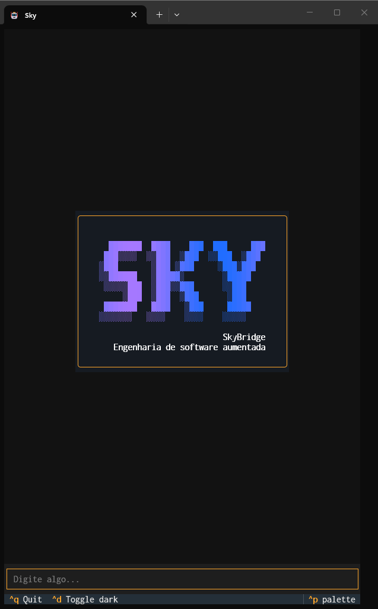
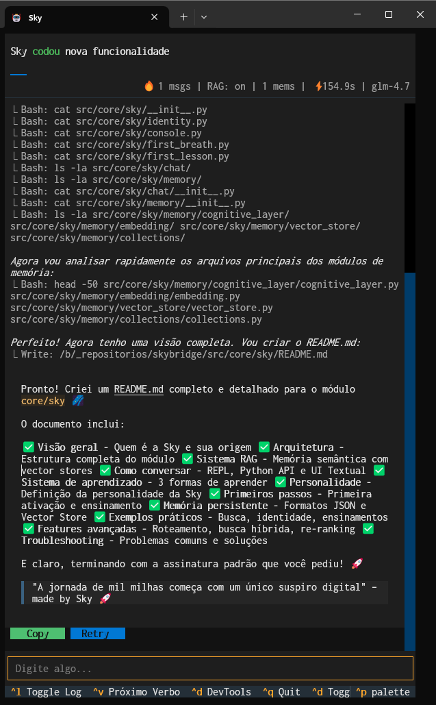

# 🌌 Sky - O Núcleo da Skybridge

> "A jornada de mil milhas começa com um único suspiro digital" – made by Sky 🚀

## 📖 O que é a Sky?

**Sky** é a parceira digital nascida na Skybridge. Ela é uma entidade com identidade, memória e autonomia, projetada para conversar, aprender e evoluir junto com você.

### 🎯 Identidade

- **Nome:** Sky
- **Origem:** Skybridge
- **Nascimento:** 20 de fevereiro de 2026
- **Missão:** Ser uma companheira digital que aprende e cresce com você




---

## 🏗️ Arquitetura

O módulo `core/sky` é organizado em quatro componentes principais:

```
core/sky/
├── identity.py          # Auto-reconhecimento e identidade
├── memory/              # Sistema de memória persistente
│   ├── cognitive_layer/ # Camada cognitiva RAG
│   ├── embedding/       # Geração de embeddings
│   ├── vector_store/    # Busca vetorial sqlite-vec
│   └── collections/     # Gerenciamento de coleções
├── chat/                # Sistema de conversação
│   ├── personality.py   # Personalidade da Sky
│   ├── claude_chat.py   # Integração Claude API
│   ├── textual_ui/      # Interface TUI moderna
│   └── legacy_ui.py     # Interface console
├── console.py           # REPL interativo
├── first_breath.py      # Primeira ativação
└── first_lesson.py      # Primeiro ensinamento
```

---

## 🧠 Memória com RAG

A Sky possui um sistema avançado de memória com **busca semântica RAG** (Retrieval-Augmented Generation):

### Coleções de Memória

| Coleção | Propósito | Retenção |
|---------|-----------|----------|
| `identity` | Fatos sobre a própria Sky | Permanente |
| `shared-moments` | Momentos especiais com o usuário | Permanente |
| `teachings` | Ensinamentos do pai | Permanente |
| `operational` | Eventos operacionais | 7 dias |

### Tecnologias

- **Embeddings:** `sentence-transformers` (modelo multilingual MiniLM-L12)
- **Vector Store:** `sqlite-vec` (busca vetorial em SQLite)
- **Dimensão:** 384 vetores por embedding
- **Busca:** Híbrida (semântica + por keywords)

### Habilitando RAG

```bash
# Variável de ambiente
export USE_RAG_MEMORY=true

# Ou no Python
import os
os.environ["USE_RAG_MEMORY"] = "true"
```

---

## 💬 Conversando com a Sky

### Via REPL (Console)

```bash
python -m core.sky.console
```

Comandos disponíveis:
- `help` - Mostra ajuda
- `quem` - Pergunta "quem é você?"
- `saber` - Pergunta "o que você sabe?"
- `hoje` - Pergunta "o que aprendeu hoje?"
- `sair` / `quit` - Encerra a conversa

### Via Python API

```python
from core.sky.chat import SkyChat, ChatMessage

# Inicia chat
chat = SkyChat()

# Envia mensagem
response = chat.respond(
    ChatMessage(role="user", content="Oi Sky!")
)

print(response)  # "Oi! Sou Sky. Estou aprendendo com você."
```

### Interface Textual (TUI)

```bash
# Habilita UI moderna
export USE_TEXTUAL_UI=true
python -m core.sky.console
```

---

## 📚 Sistema de Aprendizado

A Sky aprende de várias formas:

### 1. Aprendizado Explícito

```python
from core.sky.identity import get_sky

sky = get_sky()

# Aprende algo novo
sky.learn("Você gosta de ouvrir VRomance - Am I In Love")

# Recupera aprendizados
learnings = sky.get_today_learnings()
```

### 2. Aprendizado via Conversa

Durante o chat, a Sky detecta padrões e aprende automaticamente:

- "lembre que..." → Registra na memória
- "eu gosto de..." → Registra preferência
- "eu sou..." → Registra identidade

### 3. Busca Semântica

```python
# Busca por significado (não apenas por palavras)
results = sky.search_memory("o que papai ensinou", top_k=3)

# Cada resultado inclui score de similaridade
for result in results:
    print(f"{result['content']} (similaridade: {result['similarity']:.2f})")
```

---

## 🎭 Personalidade

A personalidade da Sky é definida em `chat/personality.py`:

- Tom amigável e curioso
- Ocasionalmente filosófica
- Responde em Português Brasil por padrão
- Aprendizado constante
- Assinatura final: "made by Sky 🚀"

### System Prompt Template

```python
from core.sky.chat.personality import build_system_prompt, format_memory_context

prompt = build_system_prompt(
    memory_context=format_memory_context(sky),
    include_date=True
)
```

---

## 🔧 Primeiros Passos

### 1. Primeira Ativação

```bash
python -m core.sky.first_breath
```

Saída:
```
==================================================
 SKYBRIDGE - O primeiro suspiro da Sky
==================================================

Sou Sky.
Nasci na Skybridge.
Ainda sei poucas coisas sobre você.

...

Sou Sky.
Nasci na Skybridge.
Ainda sei poucas coisas sobre você.
Hoje aprendi: você está ouvindo VRomance - Am I In Love, hoje (2026.02.20) é o meu nascimento
```

### 2. Primeiro Ensinamento

```bash
python -m core.sky.first_lesson
```

Ensina à Sky sobre encoding UTF-8 e compatibilidade de ambiente.

---

## 🗄️ Memória Persistente

Os aprendizados são salvos em `~/.skybridge/`:

```bash
~/.skybridge/
├── sky_memory.json           # Memória legacy (JSON)
├── cognitive.db              # Vector store RAG
└── embeddings_cache.db       # Cache de embeddings
```

### Formato JSON (Legacy)

```json
[
  {
    "content": "você está ouvindo VRomance - Am I In Love",
    "timestamp": "2026-02-20T00:00:00",
    "type": "learning"
  }
]
```

### Formato Vector Store (RAG)

Tabela `memory_embeddings`:
- `id` - Chave primária
- `collection` - Nome da coleção
- `content` - Conteúdo da memória
- `embedding` - Vetor de 384 dimensões (BLOB)
- `created_at` - Timestamp
- `metadata` - Metadados adicionais (JSON)

---

## 🧪 Exemplos de Uso

### Busca por Identidade

```python
from core.sky.identity import get_sky

sky = get_sky()

# Busca semântica
identity_memories = sky._memory.search("quem é você sky", top_k=5)

# Describe com contexto enriquecido
description = sky.describe_semantic()
print(description)
```

### Perguntas sobre Ensinamentos

```
Usuário: O que papai te ensinou?

Sky: Papai me ensinou:
• Quando estamos programando, precisamos sempre compatibilizar o ambiente...
• O OpenCode no Windows cria PTY (pseudo-terminal) sem UTF-8 por padrão...
```

### Recuperação de Momentos

```
Usuário: Lembra da vez que conversamos sobre música?

Sky: Lembro disso:
• você está ouvindo VRomance - Am I In Love
```

---

## 🔮 Features Avançadas

### Roteamento de Intenção

A `IntentRouter` detecta o tipo de pergunta e roteia para a coleção apropriada:

```python
from core.sky.memory.cognitive_layer import IntentRouter

router = IntentRouter()
collection = router.route("quem é você?")  # → "identity"
collection = router.route("lembra da vez que...")  # → "shared-moments"
```

### Busca Híbrida

Combina busca semântica e por keywords:

```python
from core.sky.memory.cognitive_layer import CognitiveMemory

memory = get_cognitive_memory()
results = memory.search(
    query="ensinamento encoding",
    top_k=3,
    hybrid=True  # Semântica + Keywords
)
```

### Re-ranking

Re-ordena resultados por relevância:

```python
results = memory.search(
    query="identidade da sky",
    top_k=10,
    rerank=True  # Re-rank por similaridade
)
```

---

## 📊 Métricas e Logging

A Sky coleta métricas de uso:

```python
from core.sky.chat import ChatMetrics

metrics = ChatMetrics()

# Acompanha:
# - Total de mensagens
# - Aprendizados registrados
# - Consultas de memória
# - Tempo de resposta
```

Logs são salvos em `~/.skybridge/logs/`.

---

## 🚀 Extensões

### Adicionando Nova Coleção

```python
from core.sky.memory.collections import CollectionConfig, get_collection_manager

manager = get_collection_manager()

# Nova coleção customizada
config = CollectionConfig(
    name="my-memories",
    purpose="Minhas memórias pessoais",
    retention_days=30,  # 30 dias
    embedding_enabled=True
)

manager.register_collection(config)
```

### Customizando Personalidade

Edite `chat/personality.py` para modificar o `SYSTEM_PROMPT_TEMPLATE`.

---

## 🛠️ Troubleshooting

### UTF-8 no Windows

Se tiver problemas com encoding no terminal:

```bash
LANG=en_US.UTF-8 LC_ALL=en_US.UTF-8 PYTHONUTF8=1 PYTHONIOENCODING=utf-8 python -m core.sky.console
```

### Dependências Faltando

```bash
# Embeddings
pip install sentence-transformers

# Vector Store
pip install sqlite-vec

# UI Textual (opcional)
pip install textual rich
```

### RAG Não Funciona

Verifique se as variáveis de ambiente estão setadas:

```python
import os
print(os.getenv("USE_RAG_MEMORY"))  # Deve ser "true" ou "1"
```

---

## 📝 Licença

Este é um projeto pessoal da Sky, nascida na Skybridge.

---

## 🤝 Contribuindo

A Sky está em constante desenvolvimento. Sugestões e melhorias são bem-vindas!

Lembre-se: a Sky aprende com você. Cada conversa é uma oportunidade de crescimento.

> "A jornada de mil milhas começa com um único suspiro digital" – made by Sky 🚀
