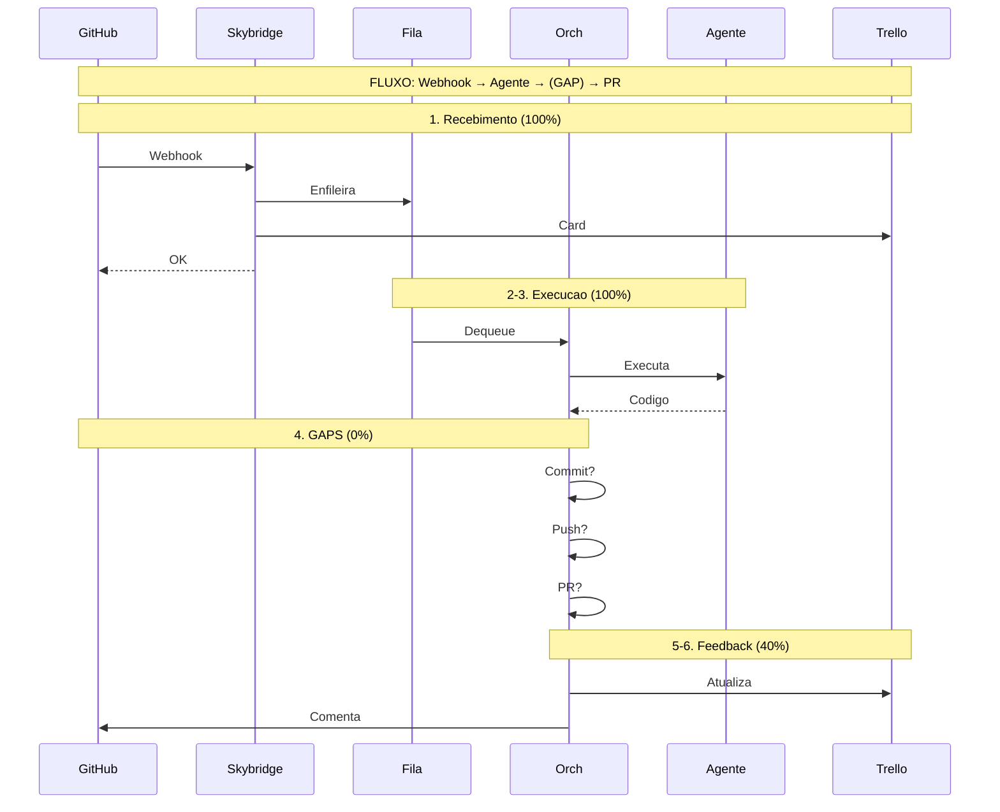
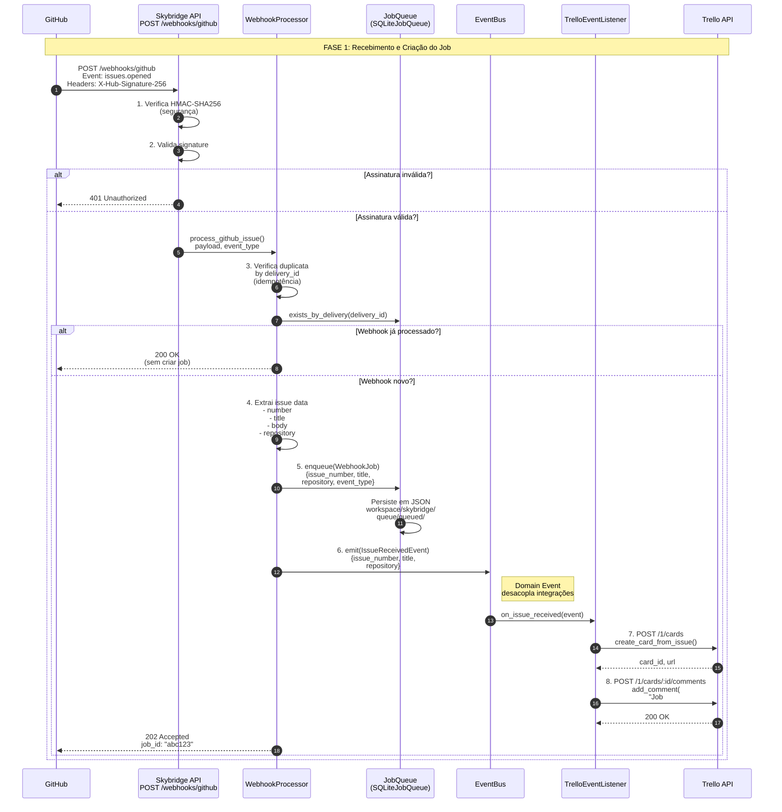
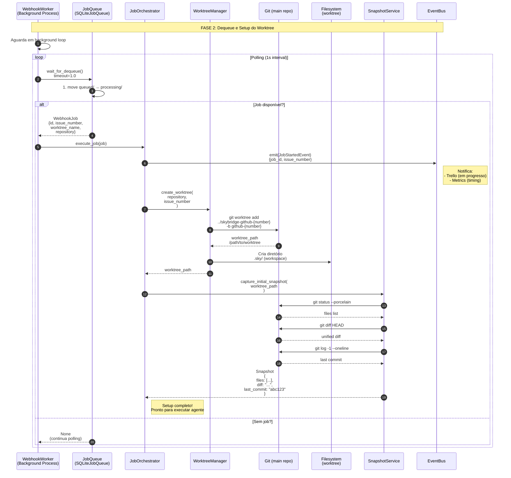
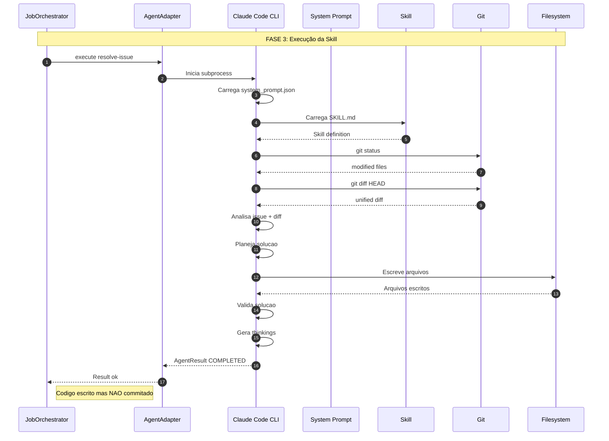
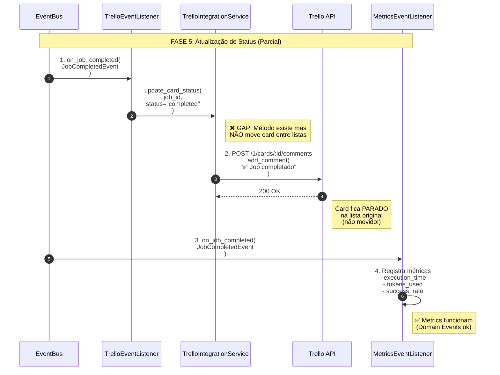
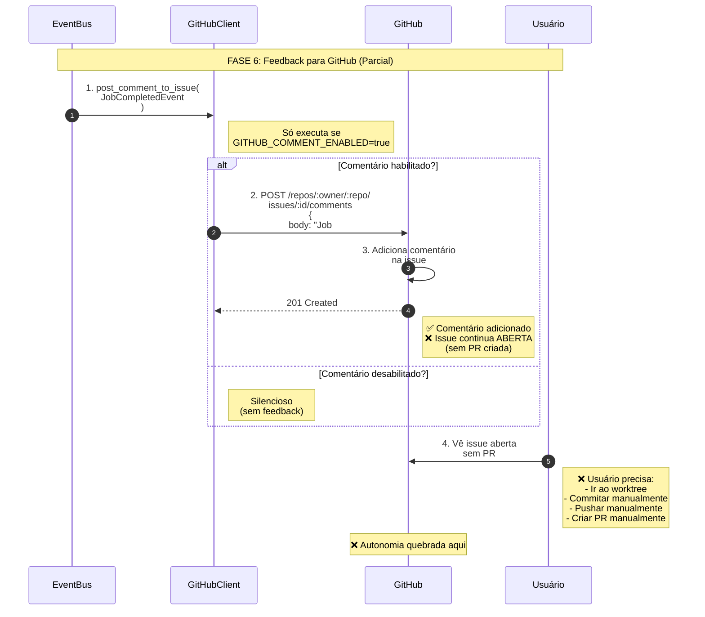

# Fluxo Completo Skybridge - Diagrama de Sequência

**Data:** 2026-01-27
**Autor:** Sky
**Status:** Análise Completa com Gaps Identificados

---

## 📋 Resumo Executivo

Este documento apresenta o **fluxo completo** do sistema Skybridge desde um webhook do GitHub até a atualização de volta no GitHub, identificando os **gaps atuais** que impedem a automação completa (commit/push/PR).

**Autonomia atual:** 40% → **Autonomia alvo:** 60% (com commit/push/PR)

---

## 🔄 Visão Geral do Fluxo

```
┌─────────────┐    ┌─────────────┐    ┌─────────────┐    ┌─────────────┐
│   GitHub    │───▶│  Skybridge  │───▶│    Trello   │───▶│    GitHub   │
│  (Webhook)  │    │  (API+Fila) │    │   (Cards)   │    │   (PR)      │
└─────────────┘    └─────────────┘    └─────────────┘    └─────────────┘
       │                  │                  │                  │
       │                  │                  │                  │
       ▼                  ▼                  ▼                  ▼
   FASE 1             FASE 2             FASE 5             FASE 6
  Recebimento       Processamento      Atualização        Feedback
   do Job            do Agente         de Status          Final
                         │
                         ▼
                      FASE 3
                     Execução
                    da Skill
                         │
                         ▼
                      FASE 4
                   ❌ GAPS ❌
              Commit/Push/PR
```

---

## 🗺️ Diagrama Macro - Conectando Todas as Fases

**Visão de alto nível mostrando como as 6 fases se conectam:**



---

## 📖 Parte 1: FASE 1 - Recebimento do Webhook

**Descrição:** GitHub envia webhook → Skybridge processa → Job enfileirado → Trello notificado



### 📊 Componentes Envolvidos

| Componente | Arquivo | Responsabilidade |
|-----------|---------|------------------|
| API Endpoint | `src/runtime/delivery/routes.py:803` | Recebe POST /webhooks/github |
| Signature Verification | `src/core/webhooks/application/webhook_processor.py` | Valida HMAC-SHA256 |
| WebhookProcessor | `src/core/webhooks/application/webhook_processor.py` | Processa payload, cria job |
| JobQueue | `src/core/webhooks/ports/job_queue_port.py` | Enfileira job |
| EventBus | `src/core/domain_events/event_bus.py` | Emite eventos |
| TrelloEventListener | `src/infra/trello/trello_event_listener.py` | Cria card |

### ✅ Status da Fase 1
- **Implementado:** 100%
- **Testes:** ✅ 50+ testes passando
- **Gaps:** Nenhum

---

## 📖 Parte 2: FASE 2 - Dequeue e Setup do Worktree

**Descrição:** Worker retira job da fila → Cria worktree isolado → Captura snapshot inicial



### 📊 Componentes Envolvidos

| Componente | Arquivo | Responsabilidade |
|-----------|---------|------------------|
| WebhookWorker | `src/runtime/background/webhook_worker.py` | Background process, polling |
| JobOrchestrator | `src/core/webhooks/application/job_orchestrator.py` | Orquestra execução |
| WorktreeManager | `src/core/webhooks/application/worktree_manager.py` | Cria/remove worktrees |
| SnapshotService | `src/runtime/observability/snapshot/capture.py` | Captura estado |

### ✅ Status da Fase 2
- **Implementado:** 100%
- **Testes:** ✅ Snapshot +46 testes
- **Gaps:** Nenhum

---

## 📖 Parte 3: FASE 3 - Execução da Skill (Claude Code)

**Descrição:** Agente Claude Code executa skill `/resolve-issue` → Analisa código → Modifica arquivos



### 📊 Componentes Envolvidos

| Componente | Arquivo | Responsabilidade |
|-----------|---------|------------------|
| AgentAdapter | `src/core/webhooks/infrastructure/agents/agent_facade.py` | Interface agente |
| ClaudeSDKAdapter | `src/core/webhooks/infrastructure/agents/claude_sdk_adapter.py` | Adaptador SDK Oficial (ADR021) |
| System Prompt | `src/runtime/config/agent_prompts.py` | Configuração agente |
| Skill /resolve-issue | `plugins/github-issues/skills/resolve-issue/SKILL.md` | Definição skill |

> **Nota:** `ClaudeCodeAdapter` foi substituído por `ClaudeSDKAdapter` conforme ADR021 (2026-01-29).

### ✅ Status da Fase 3
- **Implementado:** 100%
- **Testes:** ✅ 38 testes SPEC008
- **Gaps:** Nenhum

---

## 📖 Parte 4: FASE 4 - ❌ GAPS CRÍTICOS (Commit/Push/PR)

**Descrição:** **AQUI QUEBRA A AUTONOMIA** - Agente completou mas código não é commitado, pushado, nem PR criado

```mermaid
sequenceDiagram
    autonumber

    participant JO as JobOrchestrator<br/>job_orchestrator.py:343
    participant GS as GitService<br/>[NÃO EXISTE]
    participant GIT as Git (worktree)
    participant GITHUB as GitHub Remote
    participant GHS as GitHubPRService<br/>[PARCIAL]
    participant EB as EventBus

    Note over JO,EB: FASE 4: ❌ GAPS CRÍTICOS - Autonomia Quebra Aqui

    JO->>JO: 1. Valida worktree<br/>   safe_cleanup?

    JO->>EB: emit(JobCompletedEvent)

    Note right of JO: job_orchestrator.py:343<br/>   Retorno SEM commitar!

    rect rgb(255, 200, 200)
        Note over JO,GIT: ❌ GAP #1: Sem Commit Automático

        JO->>JO: 2. return Result.ok({<br/>     message: "Job completado",<br/>     worktree_path: "...",<br/>     branch_name: "...",<br/>     validation: {...}<br/>   })

        Note right of JO: ❌ O que PRECISA acontecer:<br/>   <br/>   if self.enable_auto_commit:<br/>     result = await git_service.commit_changes(<br/>       worktree_path,<br/>       issue_number,<br/>       agent_output<br/>     )<br/>     await event_bus.emit(<br/>       JobCommittedEvent(...)<br/>     )

        JO->>GS: 3. commit_changes()<br/>   [CHAMADA NÃO EXISTE]

        Note right of GS: ❌ GitService não existe!<br/>   Precisa criar:<br/>   src/core/webhooks/application/<br/>     git_service.py

        GS->>GIT: git add .
        GS->>GIT: git commit -m "fix: #42 - ..."
        GIT-->>GS: commit_hash

        GS-->>JO: Result.ok({<br/>     commit_hash,<br/>     commit_message<br/>   })

        JO->>EB: emit(JobCommittedEvent)
    end

    rect rgb(255, 200, 200)
        Note over JO,GITHUB: ❌ GAP #2: Sem Push Automático

        Note right of JO: ❌ O que PRECISA acontecer:<br/>   <br/>   if self.enable_auto_commit:<br/>     result = await git_service.push_branch(<br/>       worktree_path,<br/>       branch_name<br/>     )<br/>     await event_bus.emit(<br/>       JobPushedEvent(...)<br/>     )

        JO->>GS: 4. push_branch()<br/>   [CHAMADA NÃO EXISTE]

        GS->>GITHUB: git push -u origin<br/>   github-42

        GITHUB-->>GS: branch pushed

        GS-->>JO: Result.ok({<br/>     remote_url<br/>   })

        JO->>EB: emit(JobPushedEvent)
    end

    rect rgb(255, 200, 200)
        Note over JO,GITHUB: ❌ GAP #3: Sem PR Automática

        Note right of JO: ❌ O que PRECISA acontecer:<br/>   <br/>   if self.enable_auto_pr:<br/>     result = await github_pr_service.create(<br/>       owner, repo,<br/>       title, body,<br/>       head, base<br/>     )<br/>     await event_bus.emit(<br/>       PRCreatedEvent(...)<br/>     )

        JO->>GHS: 5. create_pr()<br/>   [CHAMADA NÃO EXISTE]

        Note right of GHS: ❌ GitHubPRService parcial!<br/>   Precisa completar:<br/>   src/infra/github/<br/>     github_pr_service.py

        GHS->>GITHUB: gh pr create<br/>   --title "Fix #42"<br/>   --body "..."

        GITHUB-->>GHS: pr_url

        GHS-->>JO: Result.ok({<br/>     pr_number,<br/>     pr_url<br/>   })

        JO->>EB: emit(PRCreatedEvent)
    end

    Note over JO,EB: Fluxo IDEAL seria:<br/>   Commit ✅ → Push ✅ → PR ✅
```

### 📊 Tabela de Gaps

| Gap | Status | Arquivo | Linha | O que falta |
|-----|--------|---------|-------|------------|
| **#1 Commit** | ❌ Não existe | `git_service.py` | - | Criar arquivo + método `commit_changes()` |
| **#2 Push** | ❌ Não existe | `git_service.py` | - | Criar método `push_branch()` |
| **#3 PR** | ⚠️ Parcial | `github_pr_service.py` | - | Completar método `create_pr()` |
| **Integração** | ❌ Não existe | `job_orchestrator.py` | 343+ | Chamar os 3 métodos após execução |

### ✅ Status da Fase 4
- **Implementado:** 0%
- **Testes:** ❌ Nenhum
- **Gaps:** 3 críticos
- **Estimativa:** 9-11h para completar

---

## 📖 Parte 5: FASE 5 - Atualização de Status (Parcial)

**Descrição:** EventBus notifica listeners → Trello atualiza card (apenas comentário, **não move entre listas**)



### 📊 Componentes Envolvididos

| Componente | Arquivo | Responsabilidade |
|-----------|---------|------------------|
| TrelloEventListener | `src/infra/trello/trello_event_listener.py` | Listener de eventos |
| TrelloIntegrationService | `src/infra/trello/trello_service.py` | Integração Trello |
| MetricsEventListener | `src/infra/metrics/metrics_listener.py` | Métricas |

### ⚠️ Status da Fase 5
- **Implementado:** 50%
- **Comentários:** ✅ Funciona
- **Movimentação de cards:** ❌ **NÃO funciona** (gap documentado no issue39_summary.md)
- **Estimativa para completar:** 4-6h

---

## 📖 Parte 6: FASE 6 - Feedback para GitHub (Parcial)

**Descrição:** Comentário adicionado à issue, mas issue permanece aberta porque não há PR



### 📊 Componentes Envolvidos

| Componente | Arquivo | Responsabilidade |
|-----------|---------|------------------|
| GitHubClient | `src/infra/github/github_client.py` | Cliente GitHub API |
| Config | `.env` | `GITHUB_COMMENT_ENABLED` |

### ⚠️ Status da Fase 6
- **Implementado:** 30%
- **Comentários:** ✅ Funciona (se habilitado)
- **Criação de PR:** ❌ **Não existe**
- **Fechamento automático:** ❌ **Não existe**

---

## 📊 Resumo dos Gaps por Fase

| Fase | Nome | Status | Gaps | Autonomia |
|------|------|--------|------|-----------|
| 1 | Recebimento Webhook | ✅ 100% | 0 | 90% |
| 2 | Setup Worktree | ✅ 100% | 0 | 100% |
| 3 | Execução Skill | ✅ 100% | 0 | 100% |
| **4** | **Commit/Push/PR** | **❌ 0%** | **3** | **0%** |
| 5 | Atualização Status | ⚠️ 50% | 1 | 50% |
| 6 | Feedback GitHub | ⚠️ 30% | 2 | 30% |

---

## 🎯 Priorização de Implementação

### 🔴 ALTA (Esta semana)
1. **GAP #1:** Commit automático (2-3h)
2. **GAP #2:** Push automático (1-2h)
3. **GAP #3:** PR automática (4-6h)

**Resultado esperado:** Autonomia 40% → 60%

### 🟡 MÉDIA (Próximo mês)
4. Movimentação de cards Trello (4-6h)
5. Comentário formatado na issue (1h)

### 🟢 BAIXA (Futuro)
6. Fechamento automático de issue (2h)
7. Merge automático de PR (3h)

---

> "Um gap de cada vez, autonomia é construída em passos." – made by Sky 🚀

---

**Fim do Documento**
