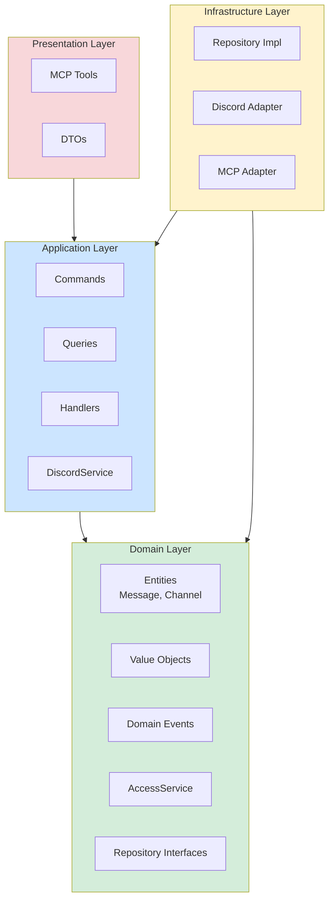

# SPEC010 — Migração do Discord para DDD

## Metadados

| Campo | Valor |
|-------|-------|
| **Status** | Rascunho |
| **Data** | 2026-03-28 |
| **Autor** | Sky usando Roo Code via GLM-5 |
| **Relacionado** | ADR002, ADR003, SPEC011, SPEC012, SPEC013 |

## Contexto

O módulo `src/core/discord` implementa um servidor MCP (Model Context Protocol) para integração entre Claude Code e Discord. Atualmente utiliza uma arquitetura **Tool-Based** com elementos de **Service Layer**.

### Arquitetura Atual

```
src/core/discord/
├── __init__.py          # Exports do módulo
├── __main__.py          # Entry point (python -m)
├── server.py            # MCP Server + handlers
├── client.py            # Discord client wrapper
├── access.py            # Access control (access.json)
├── models.py            # Modelos Pydantic
├── utils.py             # Utilitários (chunk, download, etc.)
└── tools/
    ├── reply.py             # Enviar mensagens
    ├── fetch_messages.py    # Buscar histórico
    ├── react.py             # Adicionar reações
    ├── edit_message.py      # Editar mensagens
    ├── download_attachment.py # Baixar anexos
    ├── create_thread.py     # Criar threads
    ├── list_threads.py      # Listar threads
    ├── archive_thread.py    # Arquivar threads
    └── rename_thread.py     # Renomear threads
```

### Motivação para Mudança

1. **Reutilização**: O módulo se tornou exportável para outras aplicações
2. **Manutenibilidade**: Estrutura atual não separa claramente responsabilidades
3. **Testabilidade**: Dificuldade em testar camadas isoladamente
4. **Extensibilidade**: Adicionar novos componentes UI requer mudanças em múltiplos locais

## Decisão

Adotar **Domain-Driven Design (DDD)** com 4 camadas explícitas, seguindo os padrões definidos na ADR002 e ADR003.

### Estrutura de Pastas Proposta

```
src/core/discord/
├── domain/                           # 🟢 Camada de Domínio
│   ├── __init__.py
│   ├── entities/
│   │   ├── __init__.py
│   │   ├── message.py               # Aggregate Root
│   │   ├── channel.py               # Entity
│   │   ├── thread.py                # Entity
│   │   └── attachment.py            # Entity
│   ├── value_objects/
│   │   ├── __init__.py
│   │   ├── channel_id.py
│   │   ├── message_id.py
│   │   ├── user_id.py
│   │   ├── message_content.py       # Comportamento de chunking
│   │   └── access_policy.py         # DMPolicy, GroupPolicy
│   ├── events/
│   │   ├── __init__.py
│   │   ├── message_received.py      # Domain Event
│   │   ├── message_sent.py
│   │   ├── reaction_added.py
│   │   └── thread_created.py
│   ├── services/
│   │   ├── __init__.py
│   │   ├── access_service.py        # Regras de acesso
│   │   └── message_chunker.py       # Lógica de divisão
│   └── repositories/                # Interfaces (Ports)
│       ├── __init__.py
│       ├── message_repository.py
│       └── channel_repository.py
│
├── application/                      # 🔵 Camada de Aplicação
│   ├── __init__.py
│   ├── commands/
│   │   ├── __init__.py
│   │   ├── send_message_command.py
│   │   ├── send_embed_command.py
│   │   ├── send_buttons_command.py
│   │   ├── react_command.py
│   │   ├── create_thread_command.py
│   │   └── edit_message_command.py
│   ├── queries/
│   │   ├── __init__.py
│   │   ├── fetch_messages_query.py
│   │   └── list_threads_query.py
│   ├── handlers/
│   │   ├── __init__.py
│   │   ├── command_handler.py
│   │   └── query_handler.py
│   └── services/
│       ├── __init__.py
│       └── discord_service.py       # Application Service
│
├── infrastructure/                   # 🟡 Camada de Infraestrutura
│   ├── __init__.py
│   ├── persistence/
│   │   ├── __init__.py
│   │   └── access_repository.py     # Implementação JSON
│   ├── adapters/
│   │   ├── __init__.py
│   │   ├── discord_adapter.py       # Implementação discord.py
│   │   └── mcp_adapter.py           # MCP Server
│   └── external/
│       ├── __init__.py
│       └── discord_api.py           # Wrapper discord.py
│
├── presentation/                     # 🔴 Camada de Apresentação
│   ├── __init__.py
│   ├── tools/                       # MCP Tools
│   │   ├── __init__.py
│   │   ├── reply.py
│   │   ├── send_embed.py
│   │   ├── send_progress.py
│   │   ├── send_buttons.py
│   │   ├── send_menu.py
│   │   ├── update_component.py
│   │   ├── fetch_messages.py
│   │   ├── react.py
│   │   ├── edit_message.py
│   │   ├── download_attachment.py
│   │   ├── create_thread.py
│   │   ├── list_threads.py
│   │   ├── archive_thread.py
│   │   └── rename_thread.py
│   └── dto/
│       ├── __init__.py
│       └── tool_schemas.py          # Pydantic DTOs
│
├── prompts/                          # System Instructions MCP
│   ├── __init__.py
│   ├── identidade.py
│   ├── contexto.py
│   ├── tools_guide.py
│   └── seguranca.py
│
└── interfaces/                       # Contratos Públicos
    ├── __init__.py
    └── discord_module.py            # API pública para importação
```

## Diagrama de Arquitetura



## Regras de Dependência

### Obrigatórias

1. **Domain** não depende de nenhuma outra camada
2. **Application** depende apenas de Domain
3. **Infrastructure** depende de Domain e Application
4. **Presentation** depende de Application

### Proibidas

1. ❌ Domain → Application
2. ❌ Domain → Infrastructure
3. ❌ Domain → Presentation
4. ❌ Application → Infrastructure
5. ❌ Application → Presentation

## Entidades de Domínio

### Message (Aggregate Root)

```python
@dataclass
class Message:
    """Aggregate Root representando uma mensagem Discord."""
    
    id: MessageId
    channel_id: ChannelId
    author_id: UserId
    content: MessageContent
    timestamp: datetime
    edited_at: datetime | None = None
    thread: Thread | None = None
    attachments: list[Attachment] = field(default_factory=list)
    reactions: list[Reaction] = field(default_factory=list)
    
    def edit(self, new_content: MessageContent) -> None:
        """Edita o conteúdo da mensagem."""
        if not self.can_edit():
            raise MessageEditError("Mensagem não pode ser editada")
        self.content = new_content
        self.edited_at = datetime.utcnow()
    
    def add_reaction(self, emoji: str) -> None:
        """Adiciona reação à mensagem."""
        self.reactions.append(Reaction(emoji=emoji))
    
    def can_edit(self) -> bool:
        """Verifica se mensagem pode ser editada."""
        # Regra: mensagens podem ser editadas em até 24h
        return (datetime.utcnow() - self.timestamp).total_seconds() < 86400
```

### Channel (Entity)

```python
@dataclass
class Channel:
    """Entity representando um canal Discord."""
    
    id: ChannelId
    type: ChannelType
    name: str
    guild_id: int | None = None  # None para DM
    
    def is_dm(self) -> bool:
        return self.type == ChannelType.DM
    
    def is_thread(self) -> bool:
        return self.type == ChannelType.THREAD
```

## Value Objects

### AccessPolicy

```python
class DMPolicy(Enum):
    """Política de acesso para mensagens privadas."""
    PAIRING = "pairing"      # Requer código de pareamento
    ALLOWLIST = "allowlist"  # Apenas usuários na lista
    DISABLED = "disabled"    # Bloqueia todas

@dataclass(frozen=True)
class AccessPolicy:
    """Value Object para política de acesso."""
    
    dm_policy: DMPolicy
    allow_from: frozenset[UserId]
    mention_patterns: frozenset[str]
    
    def is_allowed(self, user_id: UserId, mentioned: bool) -> bool:
        """Verifica se usuário tem acesso."""
        if self.dm_policy == DMPolicy.DISABLED:
            return False
        if self.dm_policy == DMPolicy.ALLOWLIST:
            return user_id in self.allow_from
        if self.dm_policy == DMPolicy.PAIRING:
            return user_id in self.allow_from  # Após pareamento
        return mentioned  # Grupos requerem menção
```

### MessageContent

```python
@dataclass(frozen=True)
class MessageContent:
    """Value Object para conteúdo de mensagem com chunking."""
    
    text: str
    max_length: int = 2000
    
    def __post_init__(self):
        if len(self.text) > self.max_length * 10:  # Limite máximo
            raise MessageTooLongError(f"Mensagem excede {self.max_length * 10} caracteres")
    
    def chunk(self, mode: ChunkMode = ChunkMode.LENGTH) -> list["MessageContent"]:
        """Divide mensagem em chunks para Discord."""
        if len(self.text) <= self.max_length:
            return [self]
        
        chunks = []
        remaining = self.text
        
        while remaining:
            cut = self._find_cut_point(remaining, mode)
            chunks.append(MessageContent(remaining[:cut]))
            remaining = remaining[cut:]
        
        return chunks
    
    def _find_cut_point(self, text: str, mode: ChunkMode) -> int:
        """Encontra ponto de corte ideal."""
        if mode == ChunkMode.NEWLINE:
            # Prefere quebras de parágrafo
            for delimiter in ["\n\n", "\n", " "]:
                pos = text.rfind(delimiter, 0, self.max_length)
                if pos > 0:
                    return pos
        return self.max_length
```

## Domain Events

```python
@dataclass
class MessageReceivedEvent(DomainEvent):
    """Evento: mensagem recebida do Discord."""
    
    message_id: MessageId
    channel_id: ChannelId
    author_id: UserId
    content: str
    timestamp: datetime
    has_attachments: bool = False

@dataclass
class MessageSentEvent(DomainEvent):
    """Evento: mensagem enviada para o Discord."""
    
    message_id: MessageId
    channel_id: ChannelId
    content: str
    timestamp: datetime

@dataclass
class ButtonClickedEvent(DomainEvent):
    """Evento: botão interativo clicado."""
    
    component_id: str
    user_id: UserId
    channel_id: ChannelId
    message_id: MessageId
    values: list[str]
```

## Repository Interfaces (Ports)

```python
class MessageRepository(ABC):
    """Interface para persistência de mensagens."""
    
    @abstractmethod
    async def get_by_id(self, message_id: MessageId) -> Message | None:
        """Busca mensagem por ID."""
        ...
    
    @abstractmethod
    async def save(self, message: Message) -> None:
        """Salva mensagem."""
        ...
    
    @abstractmethod
    async def get_history(
        self, 
        channel_id: ChannelId, 
        limit: int = 50
    ) -> list[Message]:
        """Busca histórico de mensagens."""
        ...

class ChannelRepository(ABC):
    """Interface para canais."""
    
    @abstractmethod
    async def get_by_id(self, channel_id: ChannelId) -> Channel | None:
        """Busca canal por ID."""
        ...
    
    @abstractmethod
    async def is_authorized(self, channel_id: ChannelId) -> bool:
        """Verifica se canal está autorizado."""
        ...
```

## Application Services

### DiscordService

```python
class DiscordService:
    """Application Service para operações Discord."""
    
    def __init__(
        self,
        message_repo: MessageRepository,
        channel_repo: ChannelRepository,
        access_service: AccessService,
        event_publisher: EventPublisher
    ):
        self._message_repo = message_repo
        self._channel_repo = channel_repo
        self._access_service = access_service
        self._event_publisher = event_publisher
    
    async def send_message(
        self, 
        command: SendMessageCommand
    ) -> SendMessageResult:
        """Envia mensagem para canal Discord."""
        # 1. Valida acesso
        channel = await self._channel_repo.get_by_id(command.channel_id)
        if not await self._access_service.can_send_to(channel):
            raise AccessDeniedError(f"Canal {command.channel_id} não autorizado")
        
        # 2. Cria entidade de domínio
        message = Message.create(
            channel_id=command.channel_id,
            content=command.content,
            author_id=command.author_id
        )
        
        # 3. Persiste
        await self._message_repo.save(message)
        
        # 4. Publica evento
        await self._event_publisher.publish(
            MessageSentEvent.from_message(message)
        )
        
        return SendMessageResult(message_id=message.id)
```

## Consequências

### Positivas

1. **Separação clara de responsabilidades** - Cada camada com função bem definida
2. **Testabilidade** - Camadas podem ser testadas isoladamente com mocks
3. **Extensibilidade** - Novos componentes UI sem modificar domínio
4. **Reutilização** - Módulo pode ser importado por outras aplicações
5. **Manutenibilidade** - Mudanças localizadas em camadas específicas

### Negativas / Trade-offs

1. **Mais arquivos** - Estrutura mais verbosa
2. **Curva de aprendizado** - Desenvolvedores precisam entender DDD
3. **Indireção** - Mais camadas entre input e output
4. **Overhead inicial** - Setup mais complexo

## Plano de Migração

### Fase 1: Preparação
- [ ] Criar estrutura de pastas
- [ ] Mover modelos Pydantic para `presentation/dto/`
- [ ] Criar interfaces de repositório

### Fase 2: Domínio
- [ ] Implementar entidades
- [ ] Implementar Value Objects
- [ ] Implementar Domain Events
- [ ] Implementar AccessService

### Fase 3: Aplicação
- [ ] Criar Commands e Queries
- [ ] Implementar Handlers
- [ ] Criar DiscordService

### Fase 4: Infraestrutura
- [ ] Implementar DiscordAdapter
- [ ] Implementar MCPAdapter
- [ ] Implementar repositórios

### Fase 5: Apresentação
- [ ] Migrar tools existentes
- [ ] Implementar novos tools de UI
- [ ] Criar prompts modulares

### Fase 7: Fóruns Discord ✅ COMPLETO
- [x] Implementar DTOs de fórum (ForumPostDTO, ForumCommentDTO, ForumTagDTO)
- [x] Criar tools MCP para posts/comentários (7 tools)
- [x] Criar tools MCP para moderação (4 tools)
- [x] Adicionar métodos de fachada no DiscordService
- [x] Implementar handlers de notificação (forum_post_created, forum_comment_added)
- [x] Extender access.json para `is_forum`
- [x] Atualizar gate_group() para fóruns

## Tools MCP de Fórum ✨ NOVO

### Posts e Comentários

| Tool | Descrição |
|------|-----------|
| `list_forum_posts` | Listar posts de fórum com paginação |
| `create_forum_post` | Criar novo post com tags |
| `get_forum_post` | Obter detalhes completos do post |
| `add_forum_comment` | Adicionar comentário a post |
| `list_forum_comments` | Listar comentários de um post |
| `update_forum_post` | Editar post existente |
| `close_forum_post` | Fechar post como resolvido |

### Moderação de Fóruns

| Tool | Descrição |
|------|-----------|
| `create_forum` | Criar novo canal de fórum na guild |
| `archive_forum` | Arquivar canal de fórum |
| `delete_forum` | Deletar canal (requer confirm=true) |
| `update_forum_settings` | Configurar tags, layout, permissões |

### DiscordService - Métodos de Fórum

```python
# Posts/Comentários
await discord_service.list_forum_posts(channel_id, limit, archived)
await discord_service.create_forum_post(channel_id, title, content, tags)
await discord_service.get_forum_post(post_id)
await discord_service.add_forum_comment(post_id, content)
await discord_service.list_forum_comments(post_id, limit)
await discord_service.update_forum_post(post_id, title, content)
await discord_service.close_forum_post(post_id)

# Moderação
await discord_service.create_forum(guild_id, name, layout)
await discord_service.archive_forum(forum_id)
await discord_service.delete_forum(forum_id, confirm=True)
await discord_service.update_forum_settings(forum_id, name, layout, default_sort_order)
```

### Controle de Acesso para Fóruns

```json
{
  "groups": {
    "forum_channel_id": {
      "requireMention": false,
      "allowFrom": ["user_id_1", "user_id_2"],
      "isForum": true
    }
  }
}
```

### Notificações de Fórum

**Novo Post Criado:**
```xml
<channel source="discord" chat_id="post_id" message_id="post_id" user="author" ts="..." interaction_type="forum_post_created" forum_channel_id="..." forum_post_id="..." post_title="...">
    [forum post] Título do post (criado em #nome-forum)
</channel>
```

**Novo Comentário:**
```xml
<channel source="discord" chat_id="thread_id" message_id="msg_id" user="author" ts="..." interaction_type="forum_comment_added" forum_channel_id="..." forum_post_id="..." comment_id="...">
    [forum comment] em Thread Name
</channel>
```

## Referências

- [ADR002 - Estrutura do Repositório Skybridge](../adr/ADR002-Estrutura%20do%20Repositório%20Skybridge.md)
- [ADR003 - Glossário, Arquiteturas e Padrões Oficiais](../adr/ADR003-Glossário,%20Arquiteturas%20e%20Padrões%20Oficiais.md)
- [SPEC011 - Padrões de UI Discord](./SPEC011-discord-ui-patterns.md)
- [SPEC012 - Prompts MCP Discord](./SPEC012-discord-prompts.md)
- [SPEC013 - Integração Discord + Paper](./SPEC013-discord-paper-integration.md)

---

> "Fronteira explícita hoje é liberdade de refatorar amanhão." – made by Sky ✨
