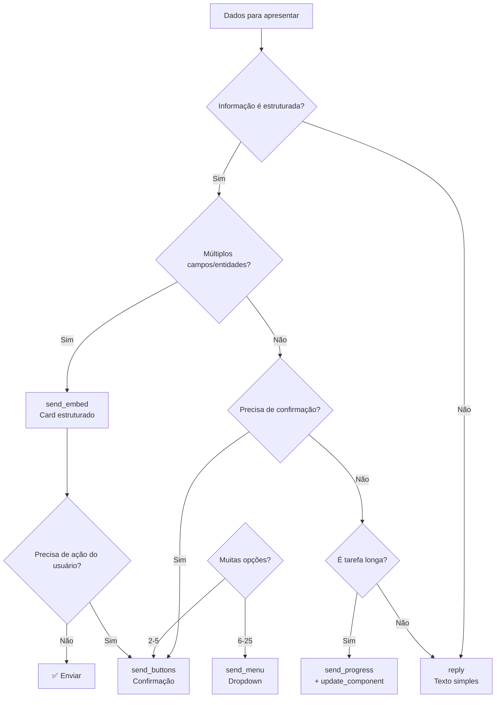

# SPEC011 — Padrões de UI Discord

## Metadados

| Campo | Valor |
|-------|-------|
| **Status** | Rascunho |
| **Data** | 2026-03-28 |
| **Autor** | Sky usando Roo Code via GLM-5 |
| **Relacionado** | SPEC010, SPEC013 |

## Contexto

Com a migração do módulo Discord para DDD (SPEC010), precisamos definir padrões de apresentação de UI que sejam compatíveis com a arquitetura de domínio e permitam que o Claude escolha como apresentar informações.

### Problema

- Claude atualmente só pode enviar texto bruto via tool `reply`
- Não há componentes visuais ricos (Embeds, Buttons, Progress)
- Interceptação de texto é frágil e imprevisível
- Necessidade de interatividade (confirmações, seleções)

## Decisão

Adotar **Tool-Based UI Selection** combinado com **DTO Projection** e **Strategy Pattern**.

### Abordagem

Em vez de interceptar texto bruto, fornecer **Tools MCP de UI** que o Claude invoca explicitamente para escolher como apresentar a informação.

## Tools MCP de UI

### 1. send_embed

Envia mensagem como Discord Embed (card rico).

```python
class SendEmbedInput(BaseModel):
    """Input para tool send_embed."""
    
    chat_id: str = Field(description="ID do canal")
    title: str = Field(description="Título do embed")
    description: str = Field(description="Conteúdo principal")
    color: Literal["azul", "verde", "vermelho", "dourado", "roxo", "cinza"] = Field(
        default="azul", description="Cor do embed"
    )
    footer: str | None = Field(default=None, description="Texto do rodapé")
    thumbnail_url: str | None = Field(default=None, description="URL da miniatura")
    fields: list[dict] | None = Field(
        default=None, 
        description="Campos adicionais [{nome, valor, inline?}]"
    )
```

**Quando usar:**
- Informação estruturada (status, relatórios)
- Destacar informações importantes
- Mostrar múltiplos campos relacionados
- Melhorar legibilidade de respostas longas

**NÃO usar para:**
- Conversas casuais (use reply normal)
- Mensagens curtas (< 200 caracteres)
- Quando o usuário pediu algo simples

### 2. send_progress

Envia indicador de progresso visual.

```python
class SendProgressInput(BaseModel):
    """Input para tool send_progress."""
    
    chat_id: str
    status: Literal["executando", "sucesso", "erro", "pendente"]
    mensagem: str
    progresso_percentual: int | None = Field(
        default=None, 
        ge=0, le=100,
        description="Porcentagem (0-100), omita para indeterminado"
    )
    detalhes: str | None = None
```

**Quando usar:**
- Tarefas demoradas (> 5 segundos)
- Usuário precisa saber que algo está acontecendo
- Mostrar conclusão de etapa

**Exemplos:**
- "Analisando código..." (executando, sem percentual)
- "Download: 45%" (executando, 45)
- "✅ Concluído!" (sucesso)

### 3. send_buttons

Envia mensagem com botões interativos.

```python
class ButtonAction(BaseModel):
    """Define botão de ação."""
    id: str = Field(description="Identificador único do botão")
    label: str = Field(description="Texto do botão")
    style: Literal["primario", "secundario", "sucesso", "perigo"] = "primario"
    emoji: str | None = None

class SendButtonsInput(BaseModel):
    """Input para tool send_buttons."""
    
    chat_id: str
    texto: str = Field(description="Texto da mensagem")
    botoes: list[ButtonAction] = Field(
        min_length=1, max_length=5,
        description="Botões (máx 5)"
    )
    efemero: bool = Field(
        default=False,
        description="Se true, só visível para o usuário"
    )
```

**Quando usar:**
- Usuário precisa escolher entre poucas opções (2-5)
- Confirmar ação (Confirmar/Cancelar)
- Ações rápidas (Sim/Não/Talvez)

**O botão clicado gera notificação inbound com button_id.**

### 4. send_menu

Envia menu dropdown de opções.

```python
class MenuOption(BaseModel):
    """Opção do menu."""
    valor: str = Field(description="Valor retornado ao selecionar")
    label: str = Field(description="Texto visível")
    descricao: str | None = None
    emoji: str | None = None

class SendMenuInput(BaseModel):
    """Input para tool send_menu."""
    
    chat_id: str
    texto: str
    placeholder: str = Field(default="Selecione uma opção...")
    opcoes: list[MenuOption] = Field(min_length=1, max_length=25)
    multipla_selecao: bool = Field(default=False, description="Permitir múltiplas seleções")
```

**Quando usar:**
- Muitas opções (5-25)
- Seleção de item de lista
- Configurações com várias alternativas

**A seleção gera notificação inbound com valor(es) selecionado(s).**

### 5. update_component

Atualiza componente existente.

```python
class UpdateComponentInput(BaseModel):
    """Input para tool update_component."""
    
    chat_id: str
    message_id: str = Field(description="ID da mensagem a atualizar")
    embed: SendEmbedInput | None = None
    progress: SendProgressInput | None = None
    desabilitar_botoes: bool = Field(default=False)
```

**Quando usar:**
- Progresso mudou (10% → 50% → 100%)
- Editar embed com novas informações
- Desabilitar botões após ação

## Padrões de Design

### 1. DTO Projection

Projeção de entidades de domínio para formato de apresentação.

```python
# presentation/projections/portfolio_projection.py

class PortfolioEmbedProjection(BaseModel):
    """Projeção de Portfolio para formato Discord Embed."""
    
    titulo: str
    descricao: str
    cor: str  # "verde" se pnl >= 0, senão "vermelho"
    campos: list[CampoProjection]
    rodape: str
    
    @classmethod
    def from_portfolio(cls, portfolio: Portfolio) -> "PortfolioEmbedProjection":
        """Cria projeção a partir da entidade de domínio."""
        return cls(
            titulo=f"📊 Portfolio {portfolio.nome}",
            descricao=f"Posições: {len(portfolio.posicoes)}",
            cor="verde" if portfolio.pnl >= 0 else "vermelho",
            campos=[
                CampoProjection(nome="💰 Saldo", valor=f"R$ {portfolio.saldo_atual:,.2f}"),
                CampoProjection(nome="📈 PnL", valor=f"R$ {portfolio.pnl:,.2f}"),
                CampoProjection(nome="📊 %", valor=f"{portfolio.pnl_percentual:.1f}%"),
            ],
            rodape=f"Atualizado em {datetime.now().strftime('%H:%M:%S')}"
        )
    
    def to_discord_embed(self) -> Embed:
        """Converte para Value Object do Discord."""
        return Embed(
            title=self.titulo,
            description=self.descricao,
            color=self._map_color(self.cor),
            fields=[EmbedField(**c.model_dump()) for c in self.campos],
            footer=EmbedFooter(text=self.rodape)
        )
```

### 2. Strategy Pattern

Diferentes estratégias de formatação.

```python
# domain/services/formatacao_strategy.py

class FormatacaoStrategy(ABC):
    """Interface para estratégias de formatação."""
    
    @abstractmethod
    def formatar(self, mensagem: Message) -> ComponenteUI:
        ...

class FormatacaoEmbedStrategy(FormatacaoStrategy):
    def formatar(self, mensagem: Message) -> EmbedComponent:
        ...

class FormatacaoSimplesStrategy(FormatacaoStrategy):
    def formatar(self, mensagem: Message) -> TextComponent:
        ...

# application/services/formatador_service.py

class FormatadorService:
    def __init__(self):
        self.strategies = {
            "embed": FormatacaoEmbedStrategy(),
            "simples": FormatacaoSimplesStrategy(),
        }
    
    def formatar(self, mensagem: Message, tipo: str) -> ComponenteUI:
        strategy = self.strategies[tipo]
        return strategy.formatar(mensagem)
```

### 3. Template Method

Estrutura consistente para tipos específicos de apresentação.

```python
# presentation/templates/relatorio_template.py

class RelatorioPerformanceTemplate:
    """Template para relatórios de performance."""
    
    def __init__(self, dados: RelatorioDTO):
        self.dados = dados
    
    def renderizar_resumo(self) -> EmbedProjection:
        """Card de resumo executivo."""
        return EmbedProjection(
            titulo="📊 Relatório Mensal",
            cor="azul",
            campos=[
                CampoProjection(nome="💰 PnL Total", valor=self._formatar_moeda(self.dados.pnl_total)),
                CampoProjection(nome="📈 Trades", valor=str(self.dados.total_trades)),
                CampoProjection(nome="🎯 Win Rate", valor=f"{self.dados.win_rate:.1f}%"),
            ]
        )
    
    def renderizar_top_trades(self) -> EmbedProjection:
        """Card de melhores trades."""
        ...
    
    def renderizar(self) -> list[EmbedProjection]:
        """Renderiza todos os cards do relatório."""
        return [
            self.renderizar_resumo(),
            self.renderizar_top_trades(),
            self.renderizar_distribuicao(),
        ]
```

### 4. Builder Pattern

Construção fluente de componentes.

```python
# presentation/builders/embed_builder.py

class EmbedBuilder:
    """Construtor fluente de Embeds."""
    
    def __init__(self):
        self._titulo = ""
        self._descricao = ""
        self._cor = "azul"
        self._campos = []
        self._rodape = None
    
    def com_titulo(self, titulo: str) -> "EmbedBuilder":
        self._titulo = titulo
        return self
    
    def com_descricao(self, descricao: str) -> "EmbedBuilder":
        self._descricao = descricao
        return self
    
    def com_cor(self, cor: str) -> "EmbedBuilder":
        self._cor = cor
        return self
    
    def adicionar_campo(self, nome: str, valor: str, inline: bool = True) -> "EmbedBuilder":
        self._campos.append(CampoProjection(nome=nome, valor=valor, inline=inline))
        return self
    
    def com_rodape(self, rodape: str) -> "EmbedBuilder":
        self._rodape = rodape
        return self
    
    def build(self) -> EmbedProjection:
        return EmbedProjection(
            titulo=self._titulo,
            descricao=self._descricao,
            cor=self._cor,
            campos=self._campos,
            rodape=self._rodape
        )

# Uso
embed = (
    EmbedBuilder()
    .com_titulo("📊 Portfolio")
    .com_descricao("Resumo do portfolio")
    .com_cor("verde")
    .adicionar_campo("Saldo", "R$ 10.000,00")
    .adicionar_campo("PnL", "R$ 500,00")
    .build()
)
```

## Matriz de Decisão



## Estrutura de Arquivos

```
src/core/discord/presentation/
├── tools/
│   ├── reply.py
│   ├── send_embed.py
│   ├── send_progress.py
│   ├── send_buttons.py
│   ├── send_menu.py
│   └── update_component.py
├── projections/
│   ├── __init__.py
│   ├── embed_projection.py
│   ├── progress_projection.py
│   ├── button_projection.py
│   └── menu_projection.py
├── builders/
│   ├── __init__.py
│   ├── embed_builder.py
│   └── component_builder.py
├── templates/
│   ├── __init__.py
│   ├── status_template.py
│   ├── error_template.py
│   ├── progress_template.py
│   └── code_template.py
└── strategies/
    ├── __init__.py
    └── formatacao_strategy.py
```

## Consequências

### Positivas

1. **Controle explícito** - Claude decide qual componente usar
2. **Previsibilidade** - Comportamento determinístico
3. **Flexibilidade** - Fácil adicionar novos componentes
4. **Interatividade** - Suporte a botões, menus, callbacks
5. **Debug** - Tools explícitas nos logs

### Negativas

1. **Mais tools** - Aumenta superfície de API
2. **Curva de aprendizado** - Claude precisa aprender quando usar cada tool
3. **Overhead** - Mais chamadas MCP para UIs complexas

## Referências

- [SPEC010 - Migração do Discord para DDD](./SPEC010-discord-ddd-migration.md)
- [SPEC013 - Integração Discord + Paper](./SPEC013-discord-paper-integration.md)
- [Discord API - Embeds](https://discord.com/developers/docs/resources/channel#embed-object)
- [Discord API - Components](https://discord.com/developers/docs/interactions/message-components)

---

> "UI é domínio do usuário, não do sistema." – made by Sky ✨
