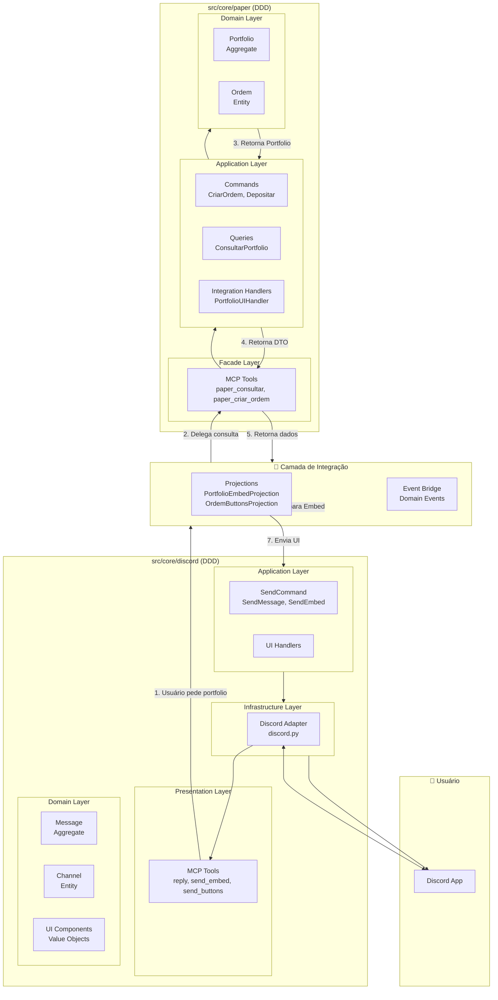
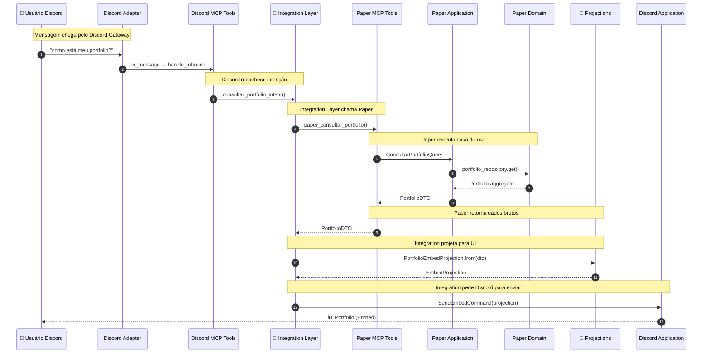
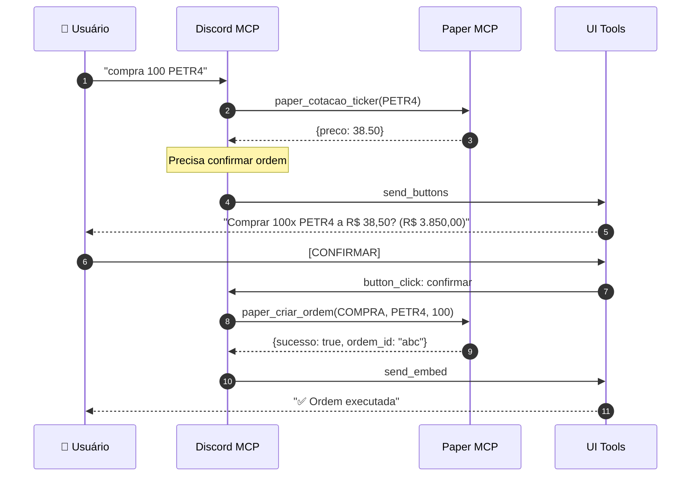
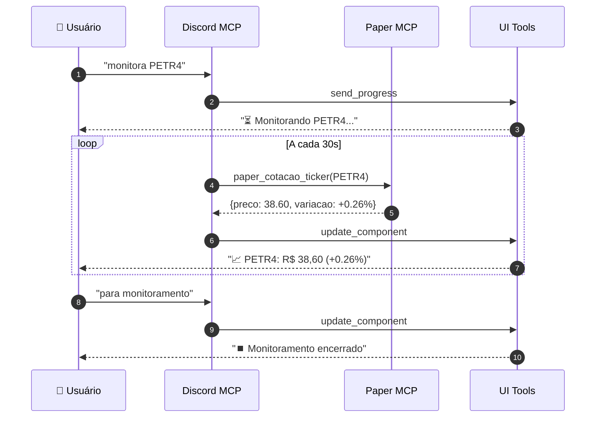
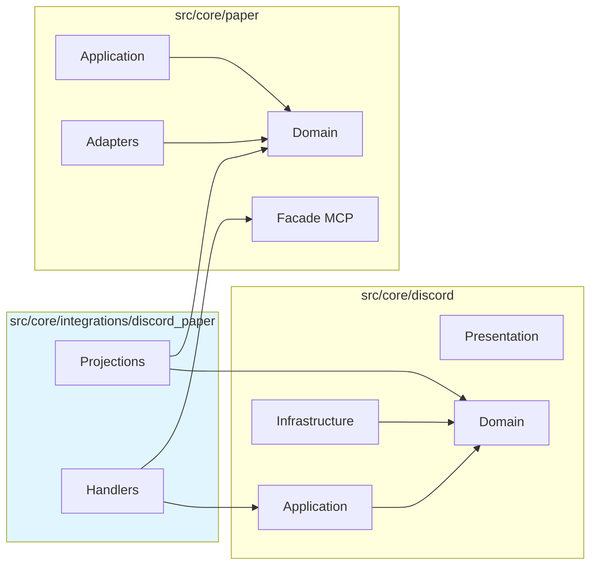

# SPEC013 — Integração Discord + Paper Trading

## Metadados

| Campo | Valor |
|-------|-------|
| **Status** | Rascunho |
| **Data** | 2026-03-28 |
| **Autor** | Sky usando Roo Code via GLM-5 |
| **Relacionado** | SPEC010, SPEC011, SPEC012 |

## Contexto

O módulo `src/core/paper` (Paper Trading) precisa se integrar com o módulo `src/core/discord` para enviar notifica, alertas e relatórios de trading via Discord. Ambos os módulos seguem arquitetura DDD, mas precisam de uma camada de integração clara.

### Problema

1. Paper e Discord são módulos independentes
2. Paper não deve conhecer detalhes de apresentação do Discord
3. Discord não deve conhecer regras de negócio do Paper
4. Necessidade de transformar dados de Paper para UI do Discord

## Decisão

Criar uma **Camada de Integração** em `src/core/integrations/discord_paper/` que atua como ponte entre os dois módulos.

### Princípio

- **Paper** conhece apenas domínio de trading
- **Discord** conhece apenas domínio de mensagens
- **Integration** conhece ambos e faz a tradução

## Arquitetura



## Estrutura de Arquivos

```
src/core/integrations/
├── __init__.py
└── discord_paper/
    ├── __init__.py
    ├── projections/
    │   ├── __init__.py
    │   ├── portfolio_projection.py    # Portfolio → Embed
    │   ├── ordem_projection.py        # Ordem → Buttons
    │   └── risco_projection.py        # Risco → Card
    ├── handlers/
    │   ├── __init__.py
    │   ├── portfolio_ui_handler.py   # Orquestra fluxo portfolio
    │   ├── ordem_ui_handler.py       # Orquestra fluxo ordem
    │   └── alerta_ui_handler.py      # Orquestra fluxo alerta
    └── events/
        ├── __init__.py
        └── paper_event_adapter.py    # Paper events → Discord
```

## O Que Reside Onde

### src/core/discord/ - Módulo Discord

| Camada | Responsabilidade | Exemplo |
|--------|------------------|---------|
| **Presentation** | MCP Tools, receber comand | `reply`, `send_embed` |
| **Application** | Orquestrar envio de mensagens | `SendEmbedCommand` |
| **Domain** | Entidades de mensagem | `Message`, `Embed` |
| **Infrastructure** | API Discord real | `discord.py` wrapper |

### src/core/paper/ - Módulo Paper Trading

| Camada | Responsabilidade | Exemplo |
|--------|------------------|---------|
| **Facade MCP** | Tools Paper para LLM | `paper_consultar_portfolio` |
| **Application** | Casos de uso Paper | `ConsultarPortfolioQuery` |
| **Domain** | Entidades de negócio | `Portfolio`, `Ordem` |

### src/core/integrations/discord_paper/ - Camada de Integração

| Componente | Responsabilidade |
|------------|------------------|
| **Projections** | Transformar entidades Paper → Value Objects Discord |
| **Handlers** | Orquestrar fluxo entre Paper e Discord |
| **Event Adapter** | Converter eventos Paper → notificações Discord |

## Cenários de UI

### Cenário 1: Consulta de Portfolio

**Contexto**: Usuário pede "como está meu portfolio?"



### Cenário 2: Criação de Ordem com Confirmação

**Contexto**: Usuário pede "compra 100 PETR4"



### Cenário 3: Monitoramento de Posição (Tempo Real)

**Contexto**: Usuário quer acompanhar posição aberta



## Projections

### PortfolioEmbedProjection

```python
# integrations/discord_paper/projections/portfolio_projection.py

from pydantic import BaseModel
from src.core.paper.domain.entities.portfolio import Portfolio
from src.core.discord.domain.value_objects.embed import Embed

class CampoProjection(BaseModel):
    """Campo de um Embed."""
    nome: str
    valor: str
    inline: bool = True

class PortfolioEmbedProjection(BaseModel):
    """Projeção de Portfolio para formato Discord Embed."""
    
    titulo: str
    descricao: str
    cor: str  # "verde" | "vermelho"
    campos: list[CampoProjection]
    rodape: str
    
    @classmethod
    def from_portfolio(cls, portfolio: Portfolio) -> "PortfolioEmbedProjection":
        """Cria projeção a partir da entidade de domínio."""
        return cls(
            titulo=f"📊 Portfolio {portfolio.nome}",
            descricao=f"Posições: {len(portfolio.posicoes)}",
            cor="verde" if portfolio.pnl >= 0 else "vermelho",
            campos=[
                CampoProjection(
                    nome="💰 Saldo",
                    valor=f"R$ {portfolio.saldo_atual:,.2f}"
                ),
                CampoProjection(
                    nome="📈 PnL",
                    valor=f"R$ {portfolio.pnl:,.2f}"
                ),
                CampoProjection(
                    nome="📊 %",
                    valor=f"{portfolio.pnl_percentual:.1f}%"
                ),
            ],
            rodape=f"Atualizado em {datetime.now().strftime('%H:%M:%S')}"
        )
    
    def to_discord_embed(self) -> Embed:
        """Converte para Value Object do Discord."""
        return Embed(
            title=self.titulo,
            description=self.descricao,
            color=self._map_color(self.cor),
            fields=[EmbedField(**c.model_dump()) for c in self.campos],
            footer=EmbedFooter(text=self.rodape)
        )
```

### OrdemButtonsProjection

```python
# integrations/discord_paper/projections/ordem_projection.py

from pydantic import BaseModel
from decimal import Decimal

class BotaoProjection(BaseModel):
    """Botão de ação."""
    id: str
    label: str
    estilo: str = "primario"
    emoji: str | None = None

class OrdemButtonsProjection(BaseModel):
    """Projeção de Ordem para formato Discord Buttons."""
    
    texto: str
    botoes: list[BotaoProjection]
    
    @classmethod
    def from_ordem_intent(
        cls,
        ticker: str,
        lado: str,
        quantidade: int,
        preco: Decimal
    ) -> "OrdemButtonsProjection":
        """Cria projeção para confirmação de ordem."""
        valor_total = quantidade * preco
        
        return cls(
            texto=f"Confirma a ordem?\n\n**{lado}** de {quantidade}x {ticker}\nPreço: R$ {preco:,.2f}\n**Total: R$ {valor_total:,.2f}**",
            botoes=[
                BotaoProjection(
                    id="confirmar_ordem",
                    label="Confirmar",
                    estilo="sucesso",
                    emoji="✅"
                ),
                BotaoProjection(
                    id="cancelar_ordem",
                    label="Cancelar",
                    estilo="secundario",
                    emoji="❌"
                ),
            ]
        )
```

## Handlers de Integração

### PortfolioUIHandler

```python
# integrations/discord_paper/handlers/portfolio_ui_handler.py

from src.core.paper.application.queries.consultar_portfolio import ConsultarPortfolioQuery
from src.core.paper.application.handlers.consultar_portfolio_handler import ConsultarPortfolioHandler
from src.core.discord.application.commands.send_embed_command import SendEmbedCommand
from src.core.discord.application.services.discord_service import DiscordService
from ..projections.portfolio_projection import PortfolioEmbedProjection

class PortfolioUIHandler:
    """
    Handler que orquestra a integração Paper → Discord.
    
    Este é o ponto central que conecta os dois módulos.
    """
    
    def __init__(
        self,
        # Dependências do Paper
        portfolio_handler: ConsultarPortfolioHandler,
        # Dependências do Discord
        discord_service: DiscordService
    ):
        self.portfolio_handler = portfolio_handler
        self.discord_service = discord_service
    
    async def handle_consultar_portfolio(
        self,
        chat_id: str,
        portfolio_id: str = "default"
    ) -> str:
        """
        Fluxo completo: consulta Paper → projeta → envia Discord.
        
        Returns:
            message_id da mensagem enviada
        """
        # 1. Consulta Paper (Application Layer)
        query = ConsultarPortfolioQuery(portfolio_id=portfolio_id)
        portfolio_dto = await self.portfolio_handler.handle(query)
        
        # 2. Cria Projeção (Integration Layer)
        projection = PortfolioEmbedProjection.from_dto(portfolio_dto)
        
        # 3. Converte para Discord Domain
        embed = projection.to_discord_embed()
        
        # 4. Envia via Discord Application Service
        command = SendEmbedCommand(
            chat_id=chat_id,
            embed=embed
        )
        message_id = await self.discord_service.send_embed(command)
        
        return message_id
```

### OrdemUIHandler

```python
# integrations/discord_paper/handlers/ordem_ui_handler.py

class OrdemUIHandler:
    """Handler para fluxo de criação de ordem com confirmação."""
    
    def __init__(
        self,
        cotacao_handler: ConsultarCotacaoHandler,
        ordem_handler: CriarOrdemHandler,
        discord_service: DiscordService,
        interaction_state_repo: InteractionStateRepository
    ):
        self.cotacao_handler = cotacao_handler
        self.ordem_handler = ordem_handler
        self.discord_service = discord_service
        self.interaction_state_repo = interaction_state_repo
    
    async def iniciar_fluxo_ordem(
        self,
        chat_id: str,
        ticker: str,
        lado: str,
        quantidade: int
    ) -> str:
        """Inicia fluxo de ordem com confirmação."""
        # 1. Consulta cotação
        cotacao = await self.cotacao_handler.handle(
            ConsultarCotacaoQuery(ticker=ticker)
        )
        
        # 2. Cria projeção de botões
        projection = OrdemButtonsProjection.from_ordem_intent(
            ticker=ticker,
            lado=lado,
            quantidade=quantidade,
            preco=cotacao.preco_atual
        )
        
        # 3. Envia botões
        command = SendButtonsCommand(
            chat_id=chat_id,
            text=projection.texto,
            buttons=[b.to_discord_button() for b in projection.botoes]
        )
        message_id = await self.discord_service.send_buttons(command)
        
        # 4. Salva estado pendente
        state = OrdemInteractionState(
            interaction_id=f"ordem_{chat_id}_{message_id}",
            chat_id=chat_id,
            ticker=ticker,
            lado=lado,
            quantidade=quantidade,
            preco=cotacao.preco_atual,
            message_id=message_id
        )
        await self.interaction_state_repo.save(state)
        
        return message_id
    
    async def processar_confirmacao(
        self,
        interaction_id: str,
        confirmado: bool
    ) -> str | None:
        """Processa confirmação de ordem."""
        state = await self.interaction_state_repo.get(interaction_id)
        
        if not state:
            raise InteractionNotFoundError(f"Interação {interaction_id} não encontrada")
        
        if confirmado:
            # Executa ordem
            command = CriarOrdemCommand(
                ticker=state.ticker,
                lado=state.lado,
                quantidade=state.quantidade,
                portfolio_id="default"
            )
            result = await self.ordem_handler.handle(command)
            
            # Atualiza UI
            await self.discord_service.update_component(
                UpdateComponentCommand(
                    chat_id=state.chat_id,
                    message_id=state.message_id,
                    disable_buttons=True,
                    embed=OrdemSucessoProjection.from_result(result).to_discord_embed()
                )
            )
            
            return result.id
        else:
            # Cancela
            await self.discord_service.update_component(
                UpdateComponentCommand(
                    chat_id=state.chat_id,
                    message_id=state.message_id,
                    disable_buttons=True,
                    text="❌ Ordem cancelada"
                )
            )
            
            return None
```

## Regras de Dependência



### Obrigatórias

1. Integration → Paper (via Facade MCP)
2. Integration → Discord (via Application Service)
3. Projections → Paper Domain (leitura)
4. Projections → Discord Domain (conversão)

### Proibidas

1. ❌ Paper → Discord (qualquer camada)
2. ❌ Discord → Paper (qualquer camada)
3. ❌ Integration → Paper Infrastructure
4. ❌ Integration → Discord Infrastructure

## Consequências

### Positivas

1. **Desacoplamento** - Paper e Discord não se conhecem
2. **Responsabilidade única** - Cada módulo com função clara
3. **Testabilidade** - Integration pode ser testada com mocks
4. **Extensibilidade** - Novos formatos de UI sem modificar Paper
5. **Reutilização** - Paper pode ter outras integrações (Slack, Teams, etc.)

### Negativas

1. **Mais camadas** - Indireção adicional
2. **Complexidade** - Mais arquivos para manter
3. **Sincronização** - Mudanças em Paper podem exigir mudanças em Projections

## Plano de Implementação

### Fase 1: Estrutura Base
- [ ] Criar pasta `src/core/integrations/discord_paper/`
- [ ] Criar `projections/__init__.py`
- [ ] Criar `handlers/__init__.py`

### Fase 2: Projections
- [ ] Implementar `PortfolioEmbedProjection`
- [ ] Implementar `OrdemButtonsProjection`
- [ ] Implementar `RiscoCardProjection`

### Fase 3: Handlers
- [ ] Implementar `PortfolioUIHandler`
- [ ] Implementar `OrdemUIHandler`
- [ ] Implementar `AlertaUIHandler`

### Fase 4: Event Bridge
- [ ] Implementar `PaperEventAdapter`
- [ ] Conectar eventos Paper → Discord notifications

### Fase 5: Integração MCP
- [ ] Registrar handlers de integração no Discord MCP Server
- [ ] Configurar injeção de dependências

## Referências

- [SPEC010 - Migração do Discord para DDD](./SPEC010-discord-ddd-migration.md)
- [SPEC011 - Padrões de UI Discord](./SPEC011-discord-ui-patterns.md)
- [SPEC012 - Prompts MCP Discord](./SPEC012-discord-prompts.md)
- [ADR002 - Estrutura do Repositório Skybridge](../adr/ADR002-Estrutura%20do%20Repositório%20Skybridge.md)

---

> "Integração é a arte de conectar sem acoplar." – made by Sky ✨
