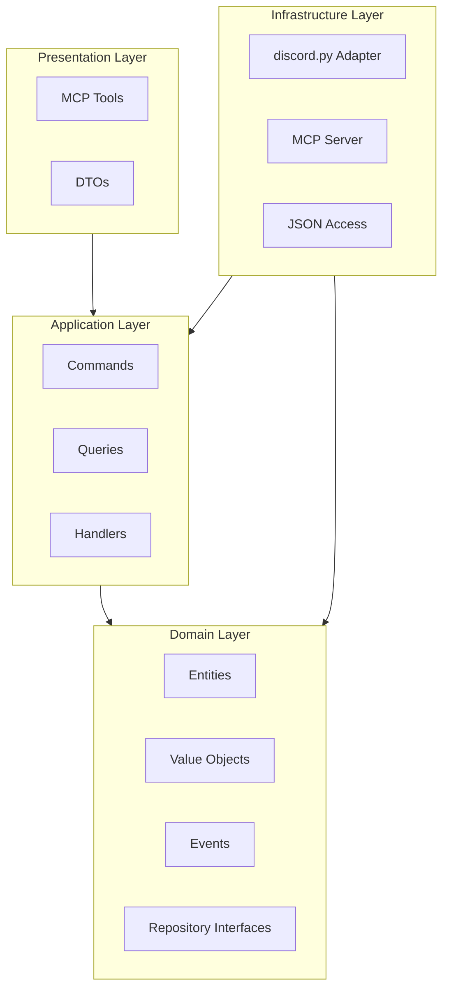

## Context

O módulo `src/core/discord` implementa um servidor MCP para integração Claude Code ↔ Discord. Atualmente possui estrutura flat com tools diretos e lógica misturada.

### Estado Atual
```
src/core/discord/
├── server.py            # MCP Server + handlers acoplados
├── client.py            # Discord client wrapper
├── access.py            # Access control inline
├── models.py            # DTOs Pydantic misturados
└── tools/               # Tools sem camada de aplicação
```

### Stakeholders
- **Claude Code**: Principal consumidor via MCP
- **Paper Trading**: Precisa enviar notificações
- **Desenvolvedores**: Manutenibilidade e testes

### Constraints
- Manter compatibilidade com MCP Tools existentes
- Não quebrar integrações ativas
- Usar apenas discord.py e pydantic (sem novas deps)

## Goals / Non-Goals

**Goals:**
- Separar responsabilidades em 4 camadas DDD
- Criar UI Tools MCP (embeds, buttons, progress)
- Prompts modulares em Português Brasileiro
- Integration Layer desacoplada Paper ↔ Discord

**Non-Goals:**
- Reescrever discord.py (apenas adaptar)
- Criar novas features de negócio
- Migrar Paper Trading (apenas integração)
- Persistir mensagens em banco de dados

## Decisions

### D1: Arquitetura em 4 Camadas

**Decisão:** Adotar DDD com camadas Domain → Application → Infrastructure → Presentation

**Alternativas Consideradas:**
| Abordagem | Prós | Contras |
|-----------|------|---------|
| **Manter atual** | Sem esforço de migração | Dificulta testes e extensão |
| **Clean Architecture** | Máximo desacoplamento | Over-engineering para escopo |
| **DDD 4 camadas** ✓ | Balanceado, reutilizável | Mais arquivos |

**Racional:** O módulo se tornou exportável e precisa de fronteira clara entre domínio e infraestrutura.

### D2: Tool-Based UI Selection

**Decisão:** Fornecer Tools MCP explícitas (`send_embed`, `send_buttons`, etc.) em vez de interceptar texto.

**Alternativas Consideradas:**
| Abordagem | Prós | Contras |
|-----------|------|---------|
| **Text Interception** | Claude decide sozinho | Frágil, imprevisível |
| **Structured Output** | Determinístico | Claude perde flexibilidade |
| **Explicit Tools** ✓ | Previsível, debuggable | Claude aprende mais tools |

**Rationale:** Claude explicitamente escolhe como apresentar, eliminando ambiguidade.

### D3: Prompts Modulares

**Decisão:** Separar prompts em arquivos por responsabilidade (identidade, contexto, tools, segurança)

**Alternativas Consideradas:**
| Abordagem | Prós | Contras |
|-----------|------|---------|
| **Prompt monolítico** | Simples | Difícil manter |
| **Prompt por tool** | Granular | Fragmentado |
| **Modular por tema** ✓ | Balanceado | Mais arquivos |

**Rationale:** Facilita atualização de seções específicas sem tocar em todo o prompt.

### D4: Integration Layer

**Decisão:** Criar `src/core/integrations/discord_paper/` como camada separada

**Alternativas Consideradas:**
| Abordagem | Prós | Contras |
|-----------|------|---------|
| **Paper conhece Discord** | Simples | Acoplamento forte |
| **Discord conhece Paper** | Simples | Acoplamento forte |
| **Event Bus global** | Desacoplado | Over-engineering |
| **Integration Layer** ✓ | Desacoplado controlado | Mais camada |

**Rationale:** Paper não conhece Discord, Discord não conhece Paper. Integration faz tradução via Projections.

### D5: Repository Pattern

**Decisão:** Definir interfaces de repositório no Domain, implementações em Infrastructure

**Rationale:** Permite trocar persistência (JSON → DB) sem tocar no domínio.

## Architecture



## Estrutura de Arquivos

```
src/core/discord/
├── domain/
│   ├── entities/           # Message, Channel, Thread
│   ├── value_objects/      # MessageContent, AccessPolicy
│   ├── events/             # MessageReceived, MessageSent
│   ├── services/           # AccessService
│   └── repositories/       # Interfaces (Ports)
├── application/
│   ├── commands/           # SendMessage, SendEmbed
│   ├── queries/            # FetchMessages, ListThreads
│   ├── handlers/           # Command/Query Handlers
│   └── services/           # DiscordService
├── infrastructure/
│   ├── persistence/        # AccessRepository (JSON)
│   └── adapters/           # DiscordAdapter, MCPAdapter
├── presentation/
│   ├── tools/              # MCP Tools
│   └── dto/                # Tool Schemas
└── prompts/                # System Instructions

src/core/integrations/discord_paper/
├── projections/            # PortfolioEmbed, OrdemButtons
├── handlers/               # PortfolioUIHandler
└── events/                 # PaperEventAdapter
```

## Risks / Trade-offs

| Risco | Mitigação |
|-------|-----------|
| **Breaking changes em tools** | Manter assinaturas compatíveis, deprecar gradualmente |
| **Claude não aprende novas tools** | Guia de tools detalhado no prompt |
| **Mais arquivos = mais manutenção** | Documentação clara, nomes descritivos |
| **Integration Layer vira god object** | Handlers específicos por cenário |
| **Testes ficam mais complexos** | Testar camadas isoladamente com mocks |

## Migration Plan

### Fase 1: Estrutura (Sem Breaking)
1. Criar estrutura de pastas
2. Mover modelos para `presentation/dto/`
3. Criar interfaces de repositório

### Fase 2: Domain
1. Implementar entidades
2. Implementar Value Objects
3. Implementar Domain Events

### Fase 3: Application
1. Criar Commands/Queries
2. Implementar Handlers
3. Criar DiscordService

### Fase 4: Infrastructure
1. Implementar DiscordAdapter
2. Implementar MCPAdapter
3. Mover access.py para persistence

### Fase 5: Presentation
1. Migrar tools existentes
2. Implementar novos tools UI
3. Criar prompts modulares

### Fase 6: Integration
1. Criar pasta `integrations/discord_paper/`
2. Implementar Projections
3. Implementar Handlers

## Open Questions

1. ~~Como identificar intents de Paper Trading?~~ → Resolvido: Integration Layer recebe chamadas explícitas
2. Precisamos de cache de mensagens? → Por ora não, buscar direto do Discord
3. Como lidar com rate limits do Discord? → discord.py já lida, não precisamos de camada extra
