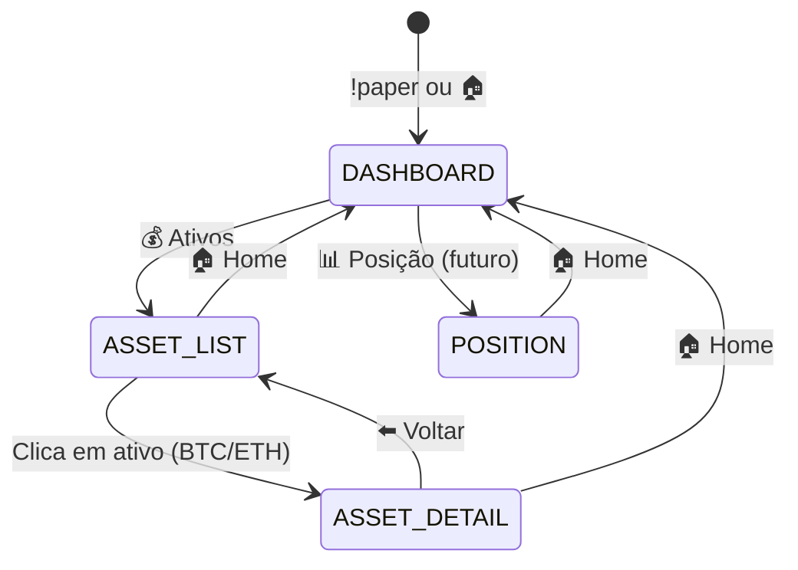
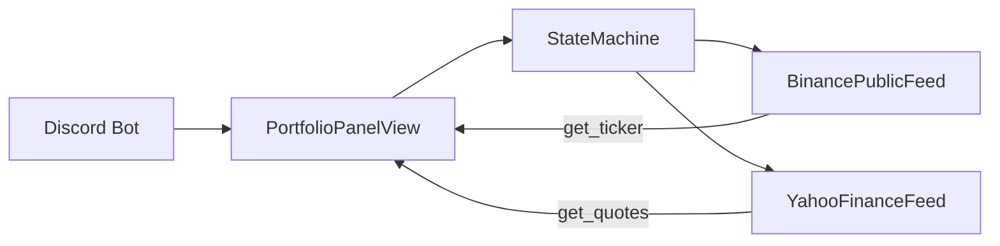
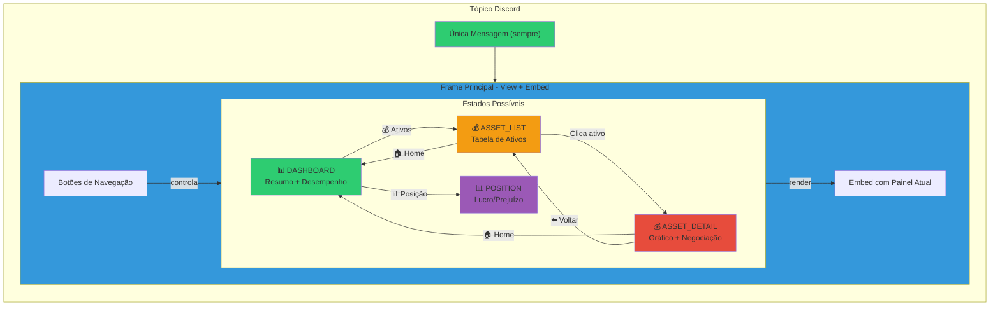
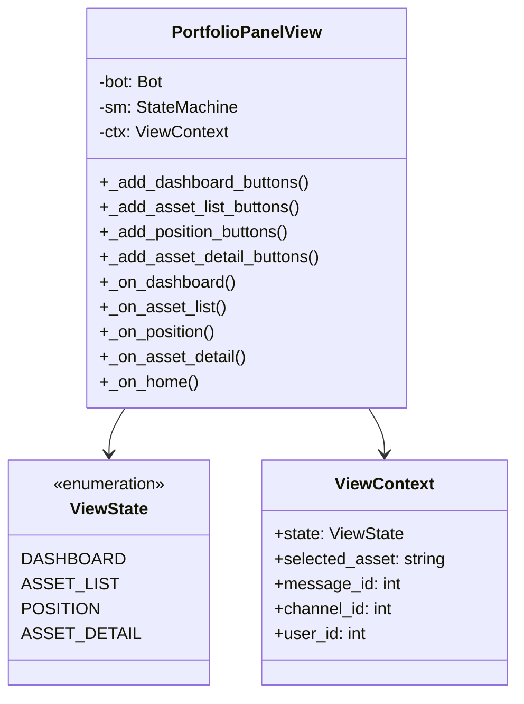
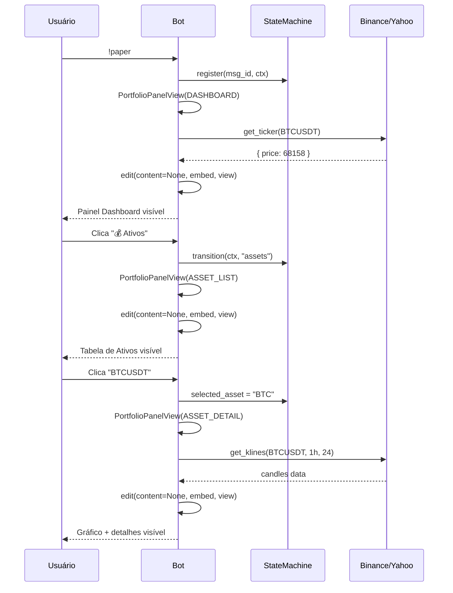

# Design - PaperBot Single-Message UI

## Context

**Problema Atual:**
O PaperBot cria uma nova mensagem a cada interação:
- Usuário executa `!paper` → Cria thread + mensagem inicial
- Clica em "Expandir" → Cria nova mensagem com conteúdo expandido
- Clica em "Ativos" → Cria nova mensagem com lista de ativos
- Resultado: Tópico com 5+ mensagens, histórico poluído, confusão sobre qual é a "versão atual"

**Stakeholders:**
- Usuários do Discord que interagem com o PaperBot
- Desenvolvedores que mantêm o código

## Goals / Non-Goals

**Goals:**
- Apenas 1 mensagem visível no tópico (single-message architecture)
- Menu de navegação persistente (Dashboard, Posição, Configuração)
- Substituição dinâmica de conteúdo via `edit()` com `content=None`
- Suporte a 4 telas principais: Dashboard, Select Ativos, Posição, Ativo Detalhe
- Dados em tempo real da Binance/Yahoo Finance

**Non-Goals:**
- Persistência de histórico (não é necessário, apenas versão atual)
- Suporte a múltiplos usuários simultâneos no mesmo tópico (cada usuário tem seu próprio painel)
- Modificação de componentes existentes do Discord.py

## Decisions

### D1: Single-Message com content=None

**Decisão:** Usar `edit(content=None, embed=..., view=...)` para substituir completamente o conteúdo da mensagem.

**Racional:** No discord.py 2.7.1, ao editar uma mensagem com embed, é necessário passar `content=None` para limpar o texto original e mostrar apenas o embed. Sem isso, o texto persiste e o embed não aparece ou aparece abaixo do texto.

**Alternativas consideradas:**
- A) `delete()` + `send()` → Remove e recriia mensagem (mais lento, novo ID)
- B) `edit()` sem `content=None` → Texto persiste (confuso visual)
- ✅ C) `edit(content=None, ...)` → Substituição limpa (escolhido)

### D2: Máquina de Estados Local

**Decisão:** Implementar máquina de estados simples com 4 estados principais (DASHBOARD, ASSET_LIST, POSITION, ASSET_DETAIL).

**Racional:** Cada estado renderiza um Embed diferente com botões específicos. A navegação é linear através do menu persistente.

**Alternativas consideradas:**
- A) Dialogs modais do Discord → Mais complexo, UX diferente
- B) Páginas separadas no Figma → Fora do escopo do Discord
- ✅ C) Estados com View → Simples, nativo do Discord (escolhido)

### D3: Botões Dinâmicos por Estado

**Decisão:** Cada estado cria sua própria View com botões específicos para aquele contexto.

**Racional:** O discord.py requer que callbacks sejam métodos assinados. Botões diferentes para estados diferentes permite callbacks limpos e separados.

**Diagrama de Estados:**

### D4: Integração Binance/Yahoo em Tempo Real

**Decisão:** Usar `BinancePublicFeed` para dados de cripto e adicionar suporte para Yahoo Finance posteriormente.

**Racional:** Binance API pública é gratuita e não requer autenticação. Yahoo Finance pode ser adicionado via `yfinance` Python library.

**Arquitetura de Dados:**

## Diagramas

### Arquitetura Single-Message

### Estrutura da View

### Fluxo de Navegação

## Risks / Trade-offs

| Risco | Mitigação |
|-------|-----------|
| **discord.py 2.7.1 compatibilidade** | Testar em versões diferentes; documentar métodos não disponíveis (`set_timestamp()`) |
| **Taxa de atualização** | Dados Binance são cacheados localmente por 30s antes de nova busca |
| **Múltiplos usuários no mesmo tópico** | Cada usuário tem sua própria view/state machine (ainda não implementado) |
| **Gráficos matplotlib podem demorar** | Usar `defer()` + `followup.send()` para não bloquear interação |
| **Falta de persistência** | Se o bot reinicia, estado é perdido (aceitável para MVP) |

## Migration Plan

### Fase 1: Refatoração Single-Message
1. Modificar `_paper` command para usar `edit(content=None, ...)`
2. Testar embed aparece corretamente
3. Validar que thread ainda é criada mas com apenas 1 mensagem editável

### Fase 2: Máquina de Estados
1. Implementar `ViewState` enum com DASHBOARD, ASSET_LIST, POSITION, ASSET_DETAIL
2. Criar `ViewContext` dataclass com `selected_asset`
3. Implementar `PortfolioPanelView` com botões dinâmicos por estado

### Fase 3: Telas Individuais
1. **Dashboard**: Resumo de corretoras + desempenho
2. **Asset List**: Tabela de ativos com dados Binance/Yahoo
3. **Asset Detail**: Gráfico candlestick + botões Comprar/Vender
4. **Position**: Lucro/prejuízo por ativo (fase futura)

### Fase 4: Integração de Dados
1. Conectar `BinancePublicFeed` para dados em tempo real
2. Adicionar cache simples (30s) para evitar rate limiting
3. Implementar fallback para dados mockados se API falhar

---

> "Design é o 'how', proposal é o 'why'" – made by Sky 🏗️
