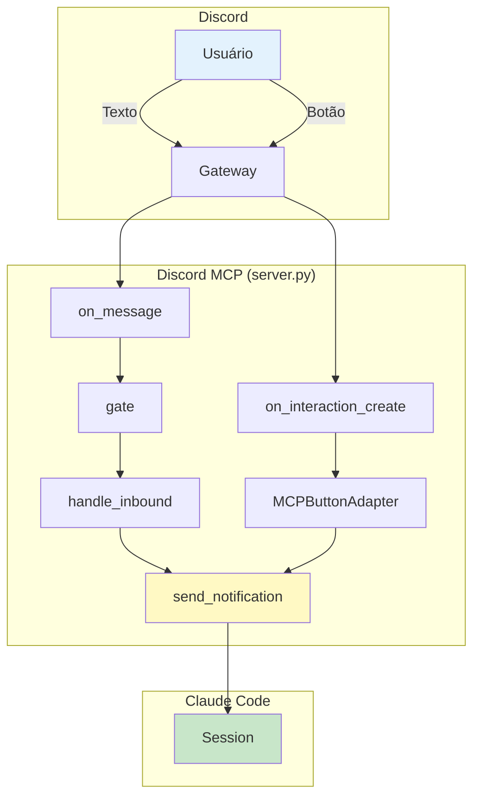
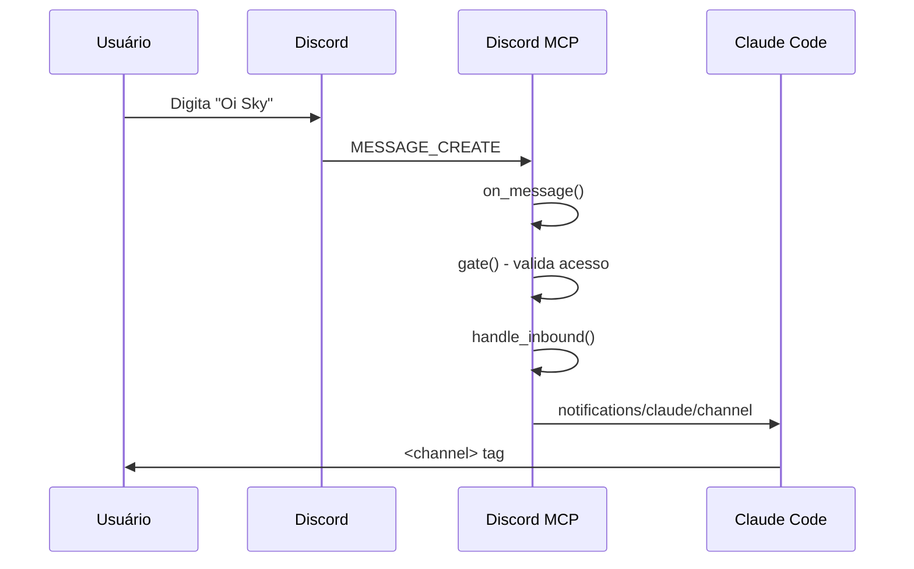
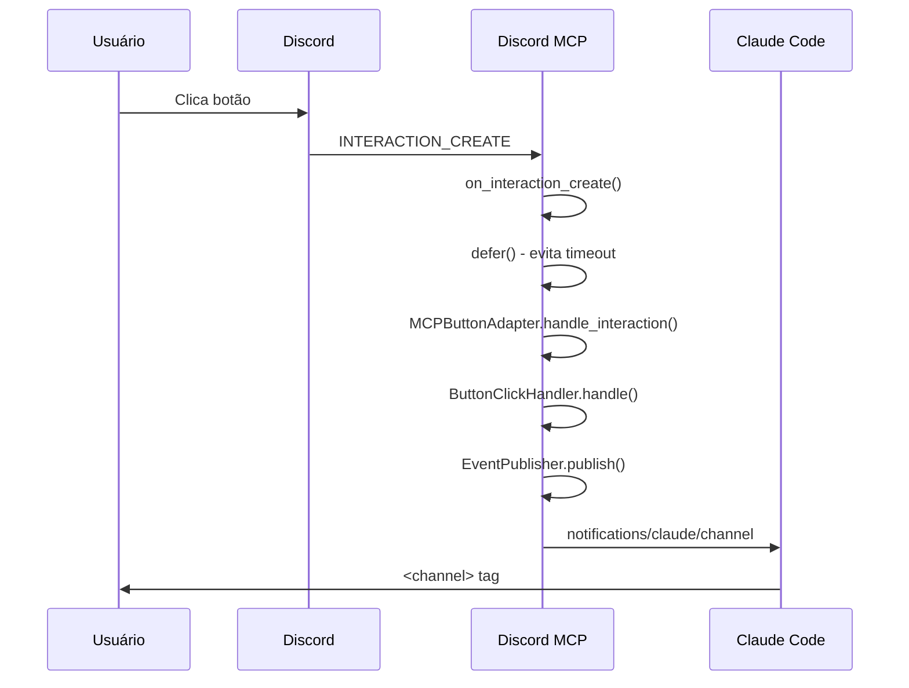
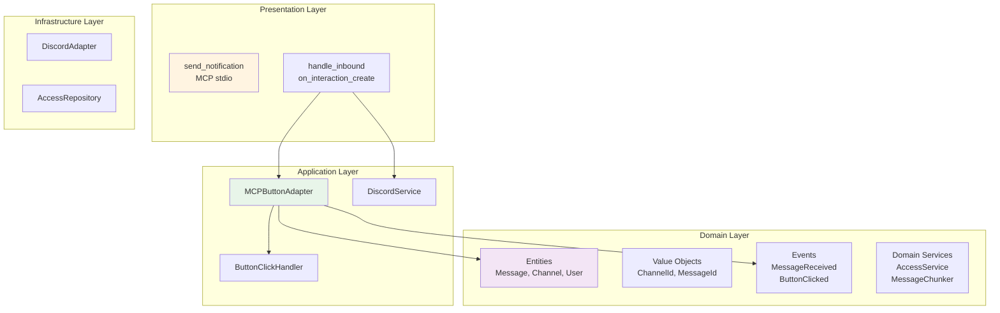

# Discord MCP - Fluxo de Mensagens (DDD)

> **Documentação baseada NO CÓDIGO REAL** em `src/core/discord/`
>
> Fluxos detalhados: [`debug_mensagem.md`](./debug_mensagem.md) | [`debug_buttons.md`](./debug_buttons.md)

---

## Visão Geral



---

## Fluxo 1: Mensagem de Texto



**Arquivo detalhado:** [`debug_mensagem.md`](./debug_mensagem.md)

**Payload MCP:**
```json
{
  "content": "Oi Sky",
  "meta": {
    "chat_id": "...",
    "message_id": "...",
    "user": ".dobrador",
    "user_id": "...",
    "ts": "2026-03-30T23:02:36.688000+00:00"
  }
}
```

---

## Fluxo 2: Clique em Botão



**Arquivo detalhado:** [`debug_buttons.md`](./debug_buttons.md)

**Payload MCP:**
```json
{
  "content": "[button] Confirmar (test_confirm)",
  "meta": {
    "chat_id": "...",
    "message_id": "...",
    "user": ".dobrador",
    "user_id": "...",
    "ts": "...",
    "interaction_type": "button_click",
    "custom_id": "test_confirm",
    "button_label": "Confirmar"
  }
}
```

---

## Arquitetura DDD - Camadas



---

## Arquivos Envolvidos

| Arquivo | Função | Linhas |
|---------|--------|--------|
| `server.py:382` | `on_message()` | 3-4 |
| `server.py:397` | `on_interaction_create()` | 77 |
| `server.py:144` | `gate()` | 48 |
| `server.py:199` | `handle_inbound()` | 95 |
| `server.py:312` | `send_notification()` | 31 |
| `mcp_button_adapter.py:50` | `handle_interaction()` | 42 |
| `mcp_button_adapter.py:94` | `_send_mcp_notification()` | 25 |
| `button_click_handler.py` | `ButtonClickHandler` | - |
| `event_publisher.py` | `EventPublisher` | - |

---

## MCP Notification Methods

| Method | Uso | Enviado por |
|--------|-----|-------------|
| `notifications/claude/channel` | Mensagens de texto e botões | `handle_inbound()`, `on_interaction_create()` |
| `notifications/claude/channel/permission` | Respostas de permissão | `handle_inbound()` |
| `notifications/claude/button_clicked` | ⚠️ DUPLICADO - não usado | `MCPButtonAdapter` (remover) |

---

## Key Points

### Mensagem de Texto ✅
1. Discord Gateway → `on_message()`
2. `gate()` valida acesso (DM policy, group policy, require_mention)
3. `handle_inbound()` prepara notification
4. `send_notification()` envia via stdio MCP
5. Claude Code recebe `<channel>` tag

### Botão ✅ (CORRIGIDO)
1. Discord Gateway → `on_interaction_create()`
2. `defer()` evita timeout
3. `MCPButtonAdapter` processa componente
4. **NOVO:** `send_notification()` envia notificação
5. Claude Code recebe `[button] LABEL (custom_id)`

### ⚠️ Problema Conhecido
- **Dupla notificação:** `MCPButtonAdapter` e `on_interaction_create` ambos enviam notificações
- **Recomendação:** Remover `_send_mcp_notification()` do `MCPButtonAdapter`
- **Detalhes:** Ver [`debug_buttons.md`](./debug_buttons.md)

---

## Documentação Adicional

| Documento | Descrição |
|-----------|-----------|
| [`debug_mensagem.md`](./debug_mensagem.md) | Fluxo completo de mensagem de texto com código |
| [`debug_buttons.md`](./debug_buttons.md) | Fluxo completo de botão com código e análise de duplicação |
| [`../../../../../docs/spec/SPEC010-discord-ddd-migration.md`](../../../../docs/spec/SPEC010-discord-ddd-migration.md) | Especificação DDD Discord |
| [`../../../../../docs/spec/SPEC014-discord-ui-views.md`](../../../../docs/spec/SPEC014-discord-ui-views.md) | UI Views e botões |

---

> "Diagrama vale mais que mil palavras, código vale mais que mil diagramas" – made by Sky 📊✨
