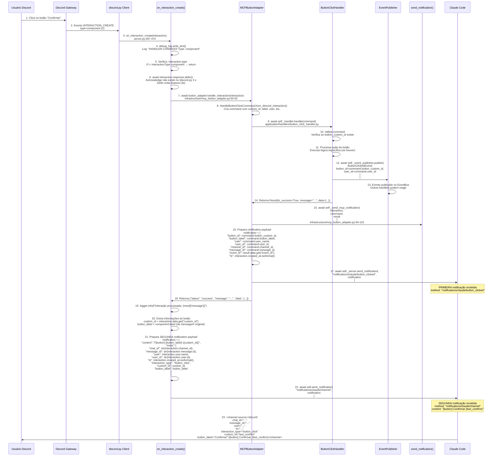

# Fluxo de Clique em Botão - Discord MCP

> Baseado no código real em `src/core/discord/server.py` e `infrastructure/mcp_button_adapter.py`

---

## Diagrama de Sequência Completo



---

## ⚠️ DUPLICAÇÃO DE NOTIFICAÇÃO DETECTADA

O código atual envia **DUAS notificações MCP** para cada clique em botão:

| Local | Method | Arquivo | Linha |
|-------|--------|---------|-------|
| MCPButtonAdapter | `notifications/claude/button_clicked` | `mcp_button_adapter.py` | 114 |
| on_interaction_create | `notifications/claude/channel` | `server.py` | 467 |

### Notificação 1: `notifications/claude/button_clicked`
```python
# infrastructure/mcp_button_adapter.py:94-119
async def _send_mcp_notification(self, interaction, command, result):
    notification = {
        "button_id": command.button_custom_id,
        "button_label": command.button_label,
        "user": command.user_name,
        "user_id": command.user_id,
        "channel_id": command.channel_id,
        "message_id": command.message_id,
        "event_id": result.data.get("event_id"),
        "ts": interaction.created_at.isoformat(),
    }
    await self._server.send_notification(
        "notifications/claude/button_clicked",
        notification,
    )
```

**Payload:**
```json
{
  "button_id": "test_confirm",
  "button_label": "Confirmar",
  "user": ".dobrador",
  "user_id": "165531471266840577",
  "channel_id": "1487521449781756066",
  "message_id": "1488312544627130401",
  "event_id": "evt_123",
  "ts": "2026-03-30T23:03:45.123000+00:00"
}
```

### Notificação 2: `notifications/claude/channel`
```python
# server.py:427-468 (adicionado na correção)
# ========================================
# CRÍTICO: Enviar notificação MCP para Claude Code
# ========================================
chat_id = str(interaction.channel_id)

custom_id = "unknown"
button_label = "unknown"

if interaction.data:
    custom_id = interaction.data.get("custom_id", "unknown")

try:
    message = interaction.message
    if message and message.components:
        for action_row in message.components:
            for component in action_row.children:
                if component.custom_id == custom_id:
                    button_label = component.label or custom_id
                    break
except Exception:
    button_label = custom_id

notification = {
    "content": f"[button] {button_label} ({custom_id})",
    "meta": {
        "chat_id": chat_id,
        "message_id": str(interaction.message.id) if interaction.message else "",
        "user": interaction.user.name,
        "user_id": str(interaction.user.id),
        "ts": interaction.created_at.isoformat(),
        "interaction_type": "button_click",
        "custom_id": custom_id,
        "button_label": button_label,
    },
}

await self.send_notification("notifications/claude/channel", notification)
```

**Payload:**
```json
{
  "content": "[button] Confirmar (test_confirm)",
  "meta": {
    "chat_id": "1487521449781756066",
    "message_id": "1488312544627130401",
    "user": ".dobrador",
    "user_id": "165531471266840577",
    "ts": "2026-03-30T23:03:45.123000+00:00",
    "interaction_type": "button_click",
    "custom_id": "test_confirm",
    "button_label": "Confirmar"
  }
}
```

---

## Código de Referência

### 1. on_interaction_create() - Entry Point
```python
# server.py:397-474
@self.discord_client.event
async def on_interaction_create(interaction):
    debug_log.write_text(f"[{datetime.now().isoformat()}] HANDLER CHAMADO! Type: {interaction.type}\n", mode='a')
    """
    Handler DDD para interações Discord (botões, select menus).

    Envia notificação MCP para Claude Code quando usuário clica em botão.
    """
    print(f"[DEBUG on_interaction_create] Interaction type: {interaction.type}")
    try:
        # Apenas interações de componente
        if interaction.type != InteractionType.component:
            print(f"[DEBUG] Não é componente, retornando")
            return

        print(f"[DEBUG] É componente! Fazendo defer...")
        # Fazer defer para evitar timeout (acknowledge não existe em discord.py 2.x)
        try:
            await interaction.response.defer()
        except Exception:
            print(f"[DEBUG] Falha no defer")
            return

        print(f"[DEBUG] Chamando adapter...")
        # Processar via adapter DDD
        result = await button_adapter.handle_interaction(interaction)

        print(f"[DEBUG] Adapter result: {result}")
        if result["status"] == "success":
            logger.info(f"Interação processada: {result['message']}")

        # ========================================
        # CRÍTICO: Enviar notificação MCP para Claude Code
        # ========================================
        # Sem isso, Claude Code nunca sabe que o botão foi clicado
        chat_id = str(interaction.channel_id)

        # Extrair informações do botão clicado
        custom_id = "unknown"
        button_label = "unknown"

        if interaction.data:
            custom_id = interaction.data.get("custom_id", "unknown")

        # Tentar obter label da mensagem original
        try:
            message = interaction.message
            if message and message.components:
                for action_row in message.components:
                    for component in action_row.children:
                        if component.custom_id == custom_id:
                            button_label = component.label or custom_id
                            break
        except Exception:
            button_label = custom_id

        # Enviar notificação MCP
        notification = {
            "content": f"[button] {button_label} ({custom_id})",
            "meta": {
                "chat_id": chat_id,
                "message_id": str(interaction.message.id) if interaction.message else "",
                "user": interaction.user.name,
                "user_id": str(interaction.user.id),
                "ts": interaction.created_at.isoformat(),
                "interaction_type": "button_click",
                "custom_id": custom_id,
                "button_label": button_label,
            },
        }

        await self.send_notification("notifications/claude/channel", notification)
        print(f"[DEBUG] Notificação MCP enviada: {custom_id}")

    except Exception as e:
        print(f"[ERROR] Erro no handler: {e}")
        import traceback
        traceback.print_exc()
        logger.error(f"Erro no handler de interação DDD: {e}")
```

### 2. MCPButtonAdapter.handle_interaction()
```python
# infrastructure/mcp_button_adapter.py:50-92
async def handle_interaction(self, interaction) -> dict:
    """
    Processa interação Discord.

    Args:
        interaction: Interação Discord (discord.Interaction)

    Returns:
        Dict com status da operação
    """
    print(f"[DEBUG MCPButtonAdapter] Interacao recebida: {interaction.type}")
    try:
        # 1. Converter para Command
        print(f"[DEBUG MCPButtonAdapter] Convertendo para command...")
        command = HandleButtonClickCommand.from_discord_interaction(interaction)
        print(f"[DEBUG MCPButtonAdapter] Command criado: {command.button_custom_id}")

        # 2. Processar via Handler
        print(f"[DEBUG MCPButtonAdapter] Processando via handler...")
        result = await self._handler.handle(command)
        print(f"[DEBUG MCPButtonAdapter] Handler result: {result.is_success}, {result.message}")

        # 3. Enviar notificação MCP para Claude Code
        if result.is_success:
            print(f"[DEBUG MCPButtonAdapter] Enviando notificacao MCP...")
            await self._send_mcp_notification(interaction, command, result)
            print(f"[DEBUG MCPButtonAdapter] Notificacao enviada!")

        return {
            "status": "success" if result.is_success else "error",
            "message": result.message,
            "data": result.data,
        }

    except Exception as e:
        print(f"[ERROR MCPButtonAdapter] Erro no adapter: {e}")
        import traceback
        traceback.print_exc()
        return {
            "status": "error",
            "message": str(e),
            "data": None,
        }
```

---

## Arquivos Envolvidos

| Arquivo | Linhas | Função |
|---------|--------|--------|
| `server.py:397` | 77 | `on_interaction_create()` - Entry point + 2ª notificação |
| `mcp_button_adapter.py:50` | 42 | `handle_interaction()` - Processa interação |
| `mcp_button_adapter.py:94` | 25 | `_send_mcp_notification()` - 1ª notificação |
| `button_click_handler.py` | - | `ButtonClickHandler.handle()` - Lógica do botão |
| `event_publisher.py` | - | Publica `ButtonClickedEvent` |

---

## Recomendação

**Remover duplicação:** Escolher UMA notificação para manter:

1. **Manter apenas `notifications/claude/channel`** (padrão com mensagens de texto)
2. **Remover `_send_mcp_notification()` do `MCPButtonAdapter`**

Isso simplifica o código e evita notificações duplicadas.

---

> "Botão sem notificação é como árvore que cai na floresta" – made by Sky 🌲
> "Mas duas notificações é como eco que confunde a floresta" – made by Sky 🦜✨
