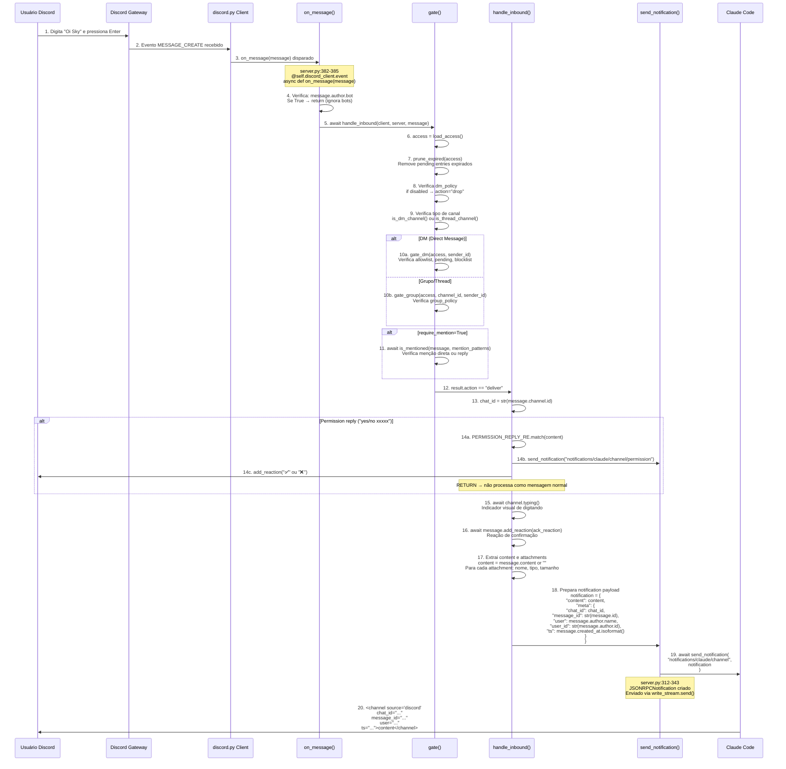

# Fluxo de Mensagem de Texto - Discord MCP

> Baseado no código real em `src/core/discord/server.py`

---

## Diagrama de Sequência Completo



---

## Código de Referência

### 1. on_message() - Entry Point
```python
# server.py:382-385
@self.discord_client.event
async def on_message(message: Message):
    if message.author.bot:
        return
    await handle_inbound(self.discord_client, self, message)
```

### 2. gate() - Validação de Acesso
```python
# server.py:144-192
async def gate(message: Message) -> dict:
    access = load_access()

    # Prune expired pending entries
    if prune_expired(access):
        save_access(access)

    # Política desabilitada
    if access.dm_policy == "disabled":
        return {"action": "drop"}

    sender_id = str(message.author.id)

    # DM ou Grupo
    if is_dm_channel(message.channel):
        result = gate_dm(access, sender_id)
        return {"action": result.action, "code": result.code, "is_resend": result.is_resend}

    # Canal de grupo
    is_thread = is_thread_channel(message.channel)
    parent_id = str(message.channel.parent_id) if is_thread else None

    result = gate_group(access, channel_id, sender_id, is_thread, parent_id)

    if result.action == "drop":
        return {"action": "drop"}

    # Verifica requireMention
    lookup_id = parent_id if is_thread else str(message.channel.id)
    policy = access.groups.get(lookup_id)

    if policy and policy.require_mention:
        mentioned = await is_mentioned(message, access.mention_patterns)
        if not mentioned:
            return {"action": "drop"}

    return {"action": "deliver", "access": access}
```

### 3. handle_inbound() - Processamento
```python
# server.py:199-294
async def handle_inbound(client: "Client", server: "DiscordMCPServer", message: Message) -> None:
    result = await gate(message)

    if result["action"] == "drop":
        return

    # Pairing mode
    if result["action"] == "pair":
        code = result["code"]
        is_resend = result.get("is_resend", False)
        lead = "Still pending" if is_resend else "Pairing required"
        await message.reply(f"{lead} — run in Claude Code:\n\n/discord:access pair {code}")
        return

    # Deliver
    chat_id = str(message.channel.id)

    # Intercepta permission reply
    perm_match = PERMISSION_REPLY_RE.match(message.content)
    if perm_match:
        behavior = "allow" if perm_match.group(1).lower().startswith("y") else "deny"
        request_id = perm_match.group(2).lower()
        await server.send_notification(
            "notifications/claude/channel/permission",
            {"request_id": request_id, "behavior": behavior},
        )
        emoji = "✅" if behavior == "allow" else "❌"
        try:
            await message.add_reaction(emoji)
        except Exception:
            pass
        return

    # Typing indicator
    if hasattr(message.channel, "typing"):
        try:
            await message.channel.typing()
        except Exception:
            pass

    # Ack reaction
    access = result.get("access")
    if access and access.ack_reaction:
        try:
            await message.add_reaction(access.ack_reaction)
        except Exception:
            pass

    # Prepara notificação
    content = message.content or ""

    # Anexos
    atts_info: list[str] = []
    if message.attachments:
        for att in message.attachments:
            kb = att.size // 1024
            name = att.filename or str(att.id)
            name = re.sub(r"[\[\]\r\n;]", "_", name)
            atts_info.append(f"{name} ({att.content_type or 'unknown'}, {kb}KB)")

        if not content:
            content = "(attachment)"

    # Envia notificação MCP
    notification = {
        "content": content,
        "meta": {
            "chat_id": chat_id,
            "message_id": str(message.id),
            "user": message.author.name,
            "user_id": str(message.author.id),
            "ts": message.created_at.isoformat(),
        },
    }

    if atts_info:
        notification["meta"]["attachment_count"] = str(len(atts_info))
        notification["meta"]["attachments"] = "; ".join(atts_info)

    await server.send_notification("notifications/claude/channel", notification)
```

### 4. send_notification() - Envio MCP
```python
# server.py:312-343
async def send_notification(self, method: str, params: dict) -> None:
    if self._write_stream is None:
        logger.warning("write_stream não disponível para notificação")
        return

    notification = JSONRPCNotification(
        jsonrpc="2.0",
        method=method,
        params=params,
    )

    try:
        message = JSONRPCMessage(notification)
        await self._write_stream.send(message)
    except Exception as e:
        logger.error(f"Erro ao enviar notificação MCP: {e}")
```

---

## Payload MCP - Mensagem de Texto

```json
{
  "content": "Oi Sky",
  "meta": {
    "chat_id": "1487521449781756066",
    "message_id": "1488312521722167477",
    "user": ".dobrador",
    "user_id": "165531471266840577",
    "ts": "2026-03-30T23:02:36.688000+00:00"
  }
}
```

### Com Attachments
```json
{
  "content": "(attachment)",
  "meta": {
    "chat_id": "1487521449781756066",
    "message_id": "1488312675170648237",
    "user": ".dobrador",
    "user_id": "165531471266840577",
    "ts": "2026-03-30T23:03:13.273000+00:00",
    "attachment_count": "2",
    "attachments": "screenshot.png (image/png, 145KB); log.txt (text/plain, 12KB)"
  }
}
```

---

## Arquivos Envolvidos

| Arquivo | Linhas | Função |
|---------|--------|--------|
| `server.py:382` | 3-4 | `on_message()` - Entry point |
| `server.py:144` | 48 | `gate()` - Valida acesso |
| `server.py:111` | 30 | `is_mentioned()` - Verifica menções |
| `server.py:199` | 95 | `handle_inbound()` - Processa mensagem |
| `server.py:312` | 31 | `send_notification()` - Envia MCP |

---

> "Cada mensagem é uma jornada através das camadas DDD" – made by Sky 🚀✨
