# Arquitetura do Módulo Paper Trading

Visão completa da arquitetura DDD + Hexagonal do `core/paper`, com diagramas Mermaid.

---

## Sumário

1. [Visão Geral](#1-visão-geral)
2. [Camadas e Dependências](#2-camadas-e-dependências)
3. [Ports — Contratos de Infraestrutura](#3-ports--contratos-de-infraestrutura)
4. [Domain — Modelo de Domínio](#4-domain--modelo-de-domínio)
5. [Adapters — Implementações Concretas](#5-adapters--implementações-concretas)
6. [Application — CQRS](#6-application--cqrs)
7. [Facade — Delivery Layer](#7-facade--delivery-layer)
8. [Fluxo de Dados: Tick do Guardião](#8-fluxo-de-dados-tick-do-guardião)
9. [Persistência e Estado](#9-persistência-e-estado)
10. [Estratégia Guardião Conservador](#10-estratégia-guardião-conservador)
11. [Eventos de Domínio](#11-eventos-de-domínio)
12. [Diagrama de Classes Completo](#12-diagrama-de-classes-completo)

---

## 1. Visão Geral

O módulo `core/paper` implementa um **paper trading engine** com arquitetura **Hexagonal (Ports & Adapters)** sobre **DDD (Domain-Driven Design)** e **CQRS** na camada de aplicação.

### Diretórios

```
src/core/paper/
├── ports/              # Interfaces (contratos)
├── domain/             # Regras de negócio puras (zero I/O)
│   ├── entities/       # Entidades com identidade
│   ├── value_objects/  # Objetos imutáveis
│   ├── events/         # Eventos de domínio + EventBus
│   ├── services/       # Serviços de domínio
│   └── strategies/     # Estratégias de trading
├── adapters/           # Implementações das ports
│   ├── brokers/        # Execução simulada
│   ├── data_feeds/     # Yahoo Finance
│   ├── currency/       # Conversão de moedas
│   └── persistence/    # JSON file storage
├── services/           # Serviços de aplicação (quantity rules)
├── application/        # CQRS commands/queries/handlers
└── facade/             # Delivery layer
    ├── api/            # REST (FastAPI)
    ├── mcp/            # Model Context Protocol
    └── sandbox/        # Loop de execução contínua
        └── workers/    # Strategy + Position workers
```

---

## 2. Camadas e Dependências

Regra fundamental: **dependências apontam para dentro**. Domain nunca importa de adapters ou facade.

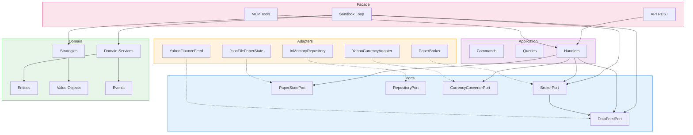

---

## 3. Ports — Contratos de Infraestrutura

Interfaces abstratas que isolam o domínio de implementações concretas.

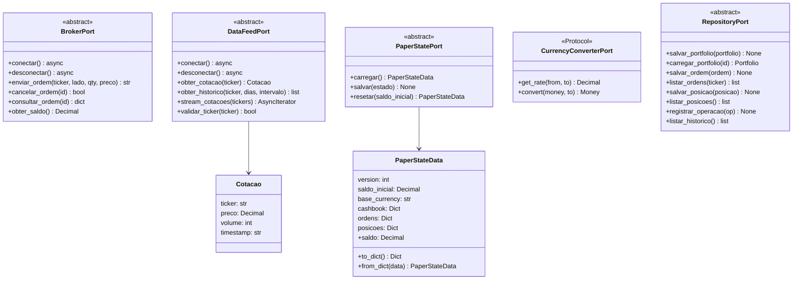

---

## 4. Domain — Modelo de Domínio

### 4.1 Value Objects

Objetos imutáveis que representam conceitos financeiros.

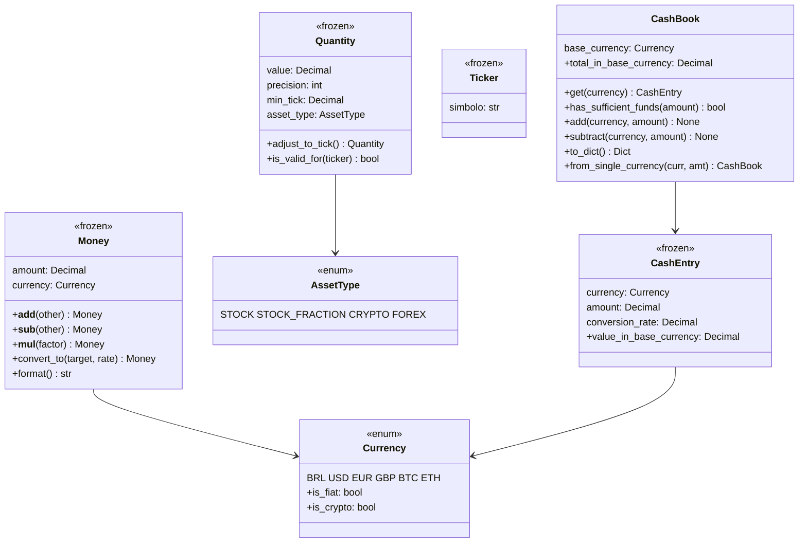

### 4.2 Entidades

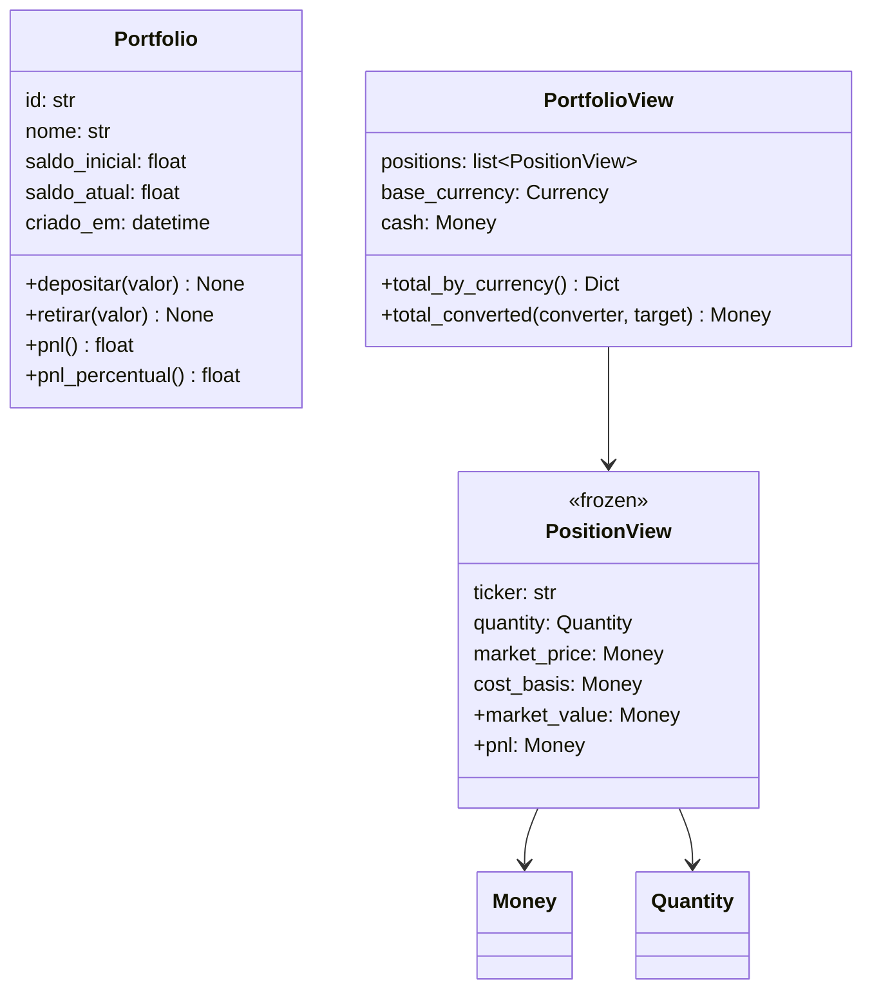

### 4.3 Worker (Domínio)

Modelo de domínio para lifecycle de workers — independente da execução física.

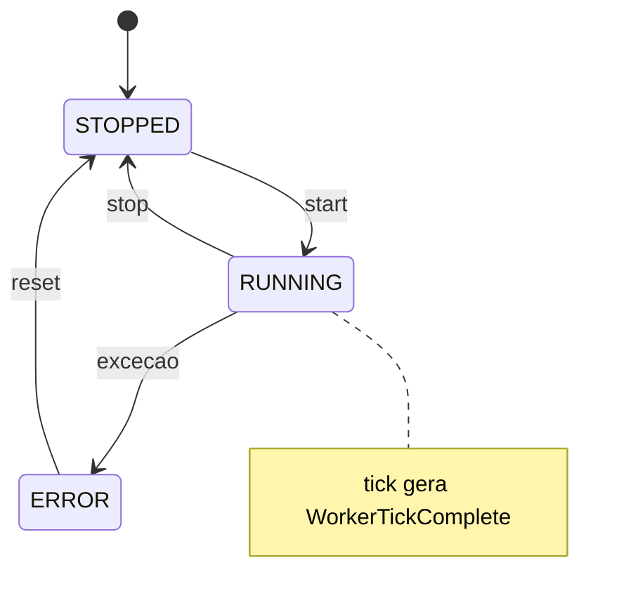

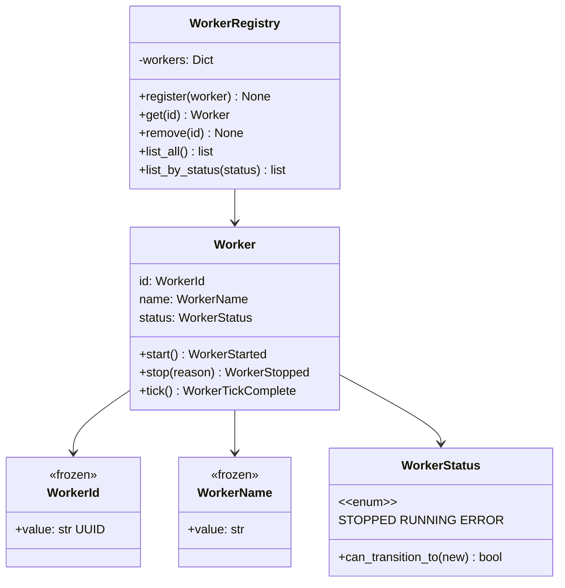

---

## 5. Adapters — Implementações Concretas

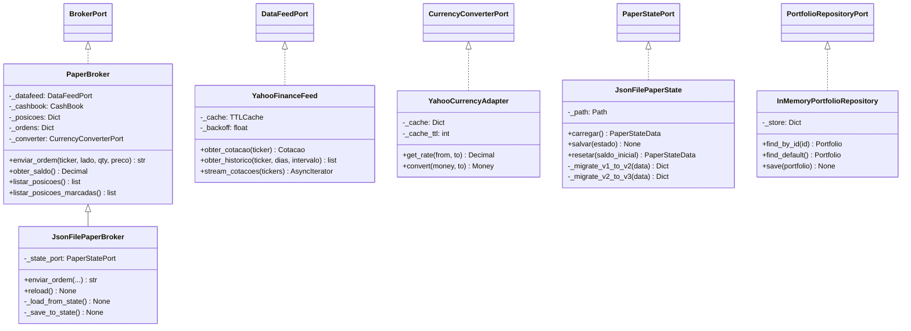

---

## 6. Application — CQRS

Commands (escrita) e Queries (leitura) separados com handlers dedicados.

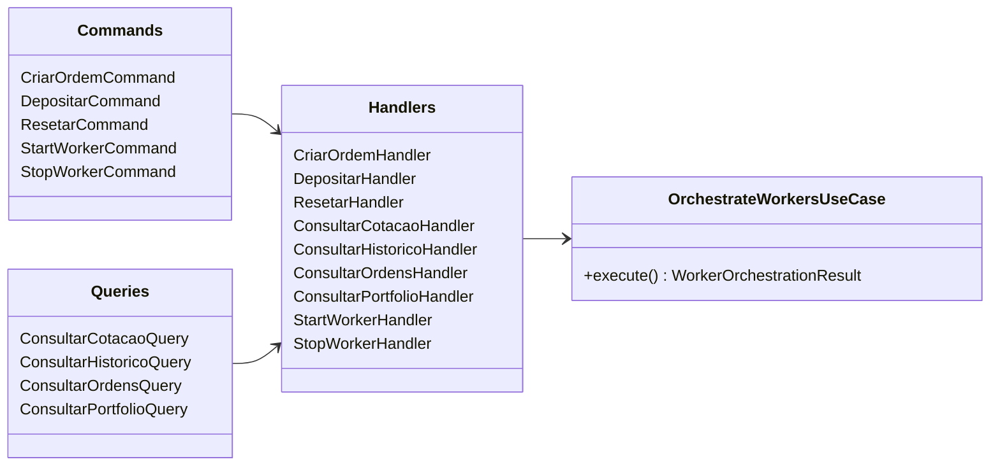

### Fluxo CQRS — Criar Ordem

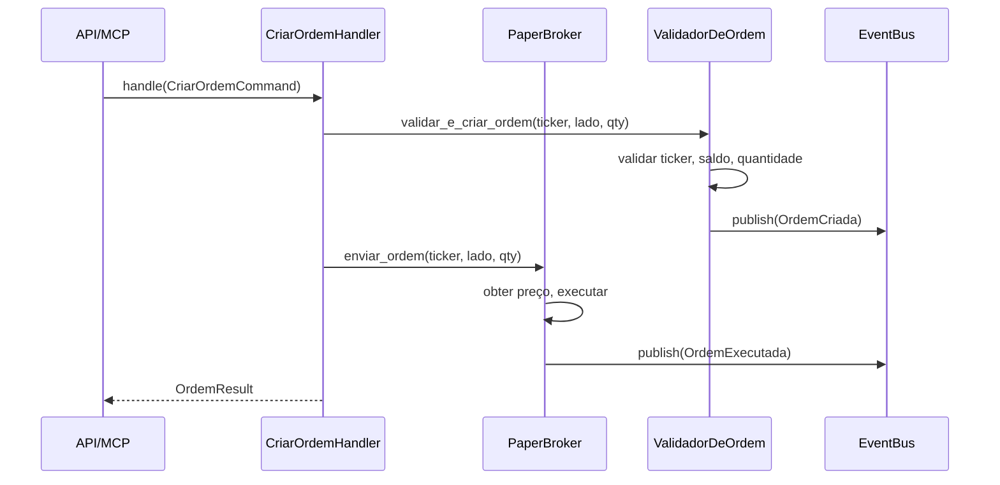

---

## 7. Facade — Delivery Layer

### 7.1 API (FastAPI)

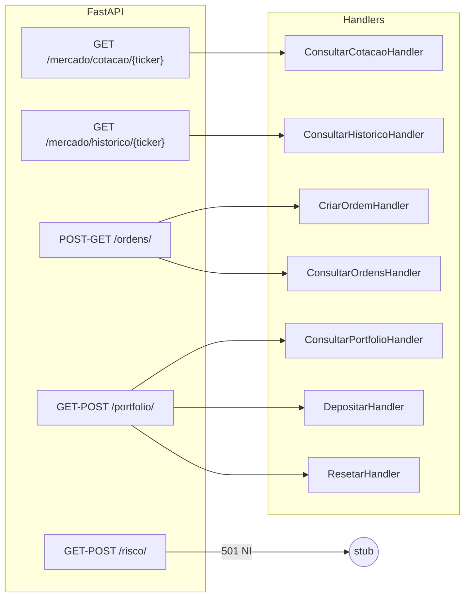

### 7.2 MCP

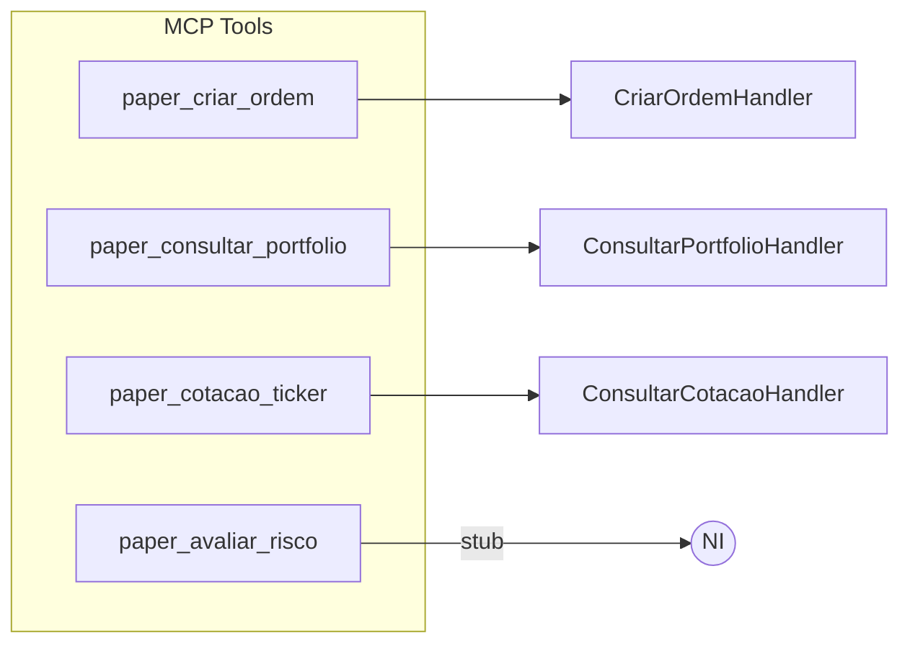

### 7.3 Sandbox — Loop de Execução Contínua

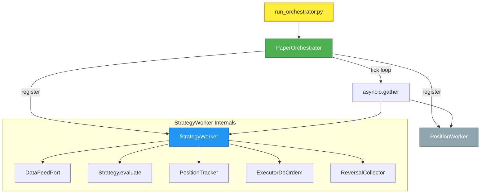

---

## 8. Fluxo de Dados: Tick do Guardião

Este é o fluxo principal de execução do sistema em produção.

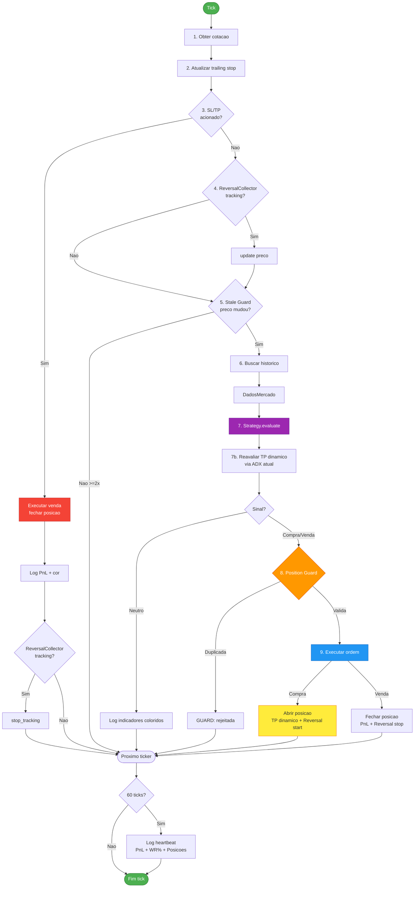

---

## 9. Persistência e Estado

### Arquivo Único: `paper_state.json`

O `JsonFilePaperState` é o **single owner** do arquivo de estado, resolvendo conflitos de escrita entre broker e repository.

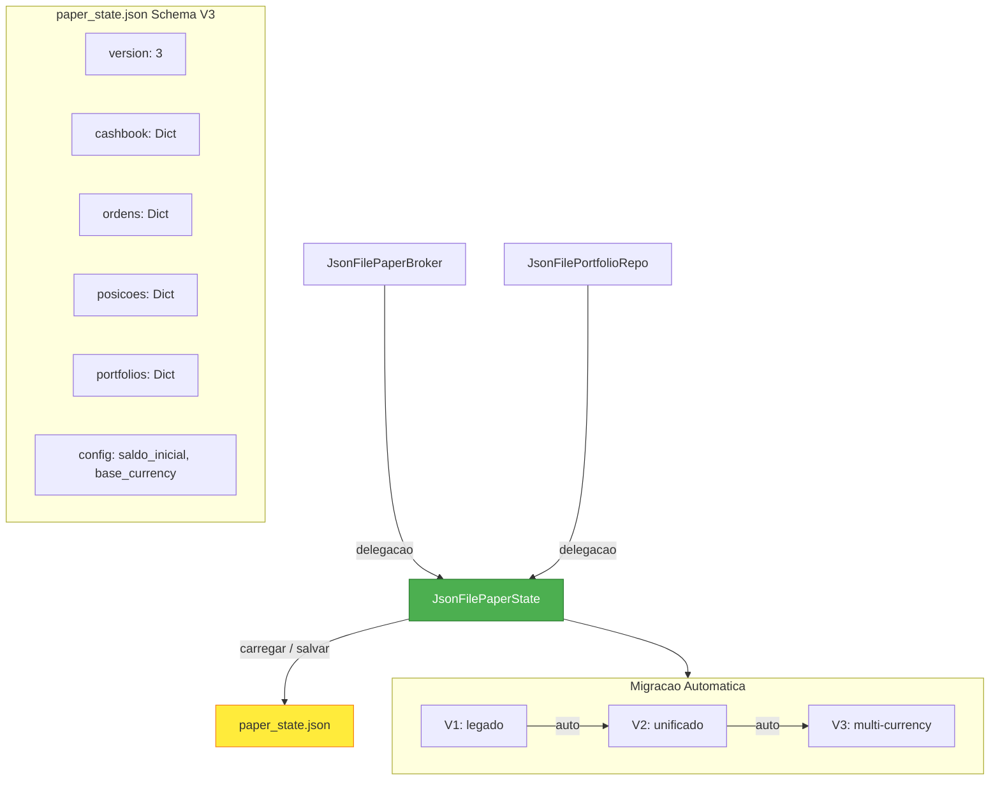

### Estado do Guardião: `guardiao-state.json`

Arquivo separado gerenciado pelo `run_orchestrator.py` para persistir o estado da sessão:

```json
{
  "positions": [...],
  "closed_pnl": [12.50, -3.20, 8.75, ...]
}
```

---

## 10. Estratégia Guardião Conservador

### Pipeline de Decisão

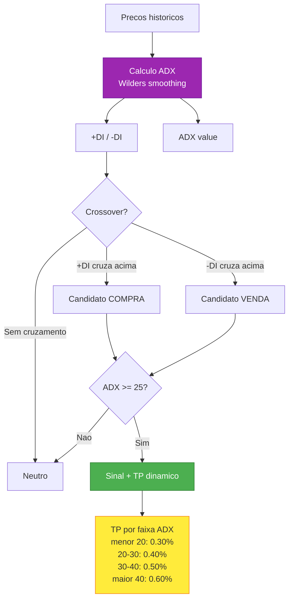

### PositionTracker — SL/TP/Trailing

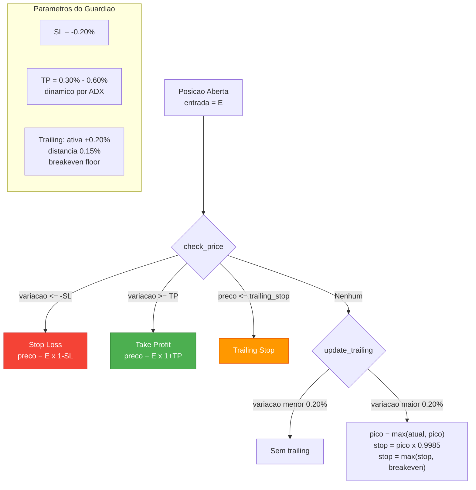

---

## 11. Eventos de Domínio

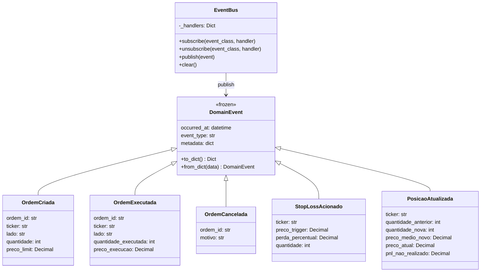

---

## 12. Diagrama de Classes Completo

Visão geral de todas as classes do módulo e seus relacionamentos.

```mermaid
graph TB
    subgraph "Domain Layer"
        direction TB
        CUR[Currency] --> MON[Money]
        AST[AssetType] --> QTY[Quantity]
        CUR --> CE[CashEntry]
        CUR --> CB[CashBook]
        CE --> CB

        PF[Portfolio] --> PV[PortfolioView]
        PV --> POSV[PositionView]
        MON --> POSV
        QTY --> POSV

        DE[DomainEvent] --> OC[OrdemCriada]
        DE --> OE[OrdemExecutada]
        DE --> OCa[OrdemCancelada]
        DE --> SLA[StopLossAcionado]
        DE --> PA[PosicaoAtualizada]

        EB[EventBus] --> DE

        VDO[ValidadorDeOrdem] --> EB
        EDO[ExecutorDeOrdem] --> EB
        CR[CalculadorDeRisco]
        GR[GeradorDeRelatorio]

        SP[StrategyProtocol] --> GC[GuardiaoConservador]
        SP --> DM[DadosMercado]
        GC --> SE[SinalEstrategia]
        PT[PositionTracker] --> SE
    end

    subgraph "Ports Layer"
        BP[BrokerPort]
        DFP[DataFeedPort] --> COT[Cotacao]
        PSP[PaperStatePort] --> PSD[PaperStateData]
        RP[RepositoryPort]
        CCP[CurrencyConverterPort]
    end

    subgraph "Adapters Layer"
        PB[PaperBroker] -.-> BP
        JFB[JsonFilePaperBroker] --> PB
        YF[YahooFinanceFeed] -.-> DFP
        YCA[YahooCurrencyAdapter] -.-> CCP
        JFPS[JsonFilePaperState] -.-> PSP
        IMR[InMemoryRepository] -.-> RP
        JFR[JsonFilePortfolioRepo] -.-> RP
    end

    subgraph "Application Layer"
        COC[CriarOrdemCommand] --> COH[CriarOrdemHandler]
        DEC[DepositarCommand] --> DEH[DepositarHandler]
        REC[ResetarCommand] --> REH[ResetarHandler]
        CCQ[ConsultarCotacaoQuery] --> CCH[ConsultarCotacaoHandler]
        CHQ[ConsultarHistoricoQuery] --> CHH[ConsultarHistoricoHandler]
        COQ[ConsultarOrdensQuery] --> COH2[ConsultarOrdensHandler]
        CPQ[ConsultarPortfolioQuery] --> CPH[ConsultarPortfolioHandler]
    end

    subgraph "Facade Layer"
        FAPI[FastAPI App] --> COH
        FMCP[MCP Facade] --> COH
        ORC[PaperOrchestrator] --> SW[StrategyWorker]
        ORC --> PW2[PositionWorker]
        SW --> GC
        SW --> PT
        SW --> EDO
        SW --> DFP
    end

    PB --> DFP
    PB --> CCP
    PB --> CB
    JFB --> PSP
    VDO --> DFP
    VDO --> CB
    EDO --> BP
    EDO --> DFP
    COH --> BP
    DEH --> PSP
    REH --> PSP
    CCH --> DFP
    CHH --> DFP
    COH2 --> BP
    COH2 --> PSP
    CPH --> BP
    CPH --> DFP
    CPH --> CCP
    GR --> CR
```

---

## KPIs do Guardião (Backtest 7d 1m BTC-USD)

| KPI | Valor | Descrição |
|---|---|---|
| PnL | +2.141% | Lucro/prejuízo total acumulado no período |
| Win Rate | 31.9% | Percentual de trades com PnL ≥ 0 |
| Sharpe Ratio | +0.090 | Retorno ajustado ao risco (risk-free = 0) |
| Max Drawdown | -1.600% | Maior queda desde o pico do patrimônio |
| Profit Factor | 1.23 | Soma ganhos / Soma perdas (> 1 é lucrativo) |
| Calmar Ratio | 1.34 | PnL anualizado / Max Drawdown anualizado |

---

> "Arquitetura é decisão que você toma uma vez e convive todos os dias." – made by Sky 🏛️
